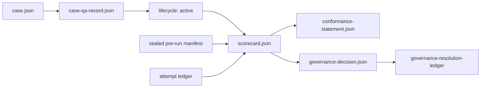

# Agent Evals Golden Standard

A versioned, implementation-independent standard for evaluating software
engineering agents and using evaluation evidence in capability, comparison,
and governance decisions.

The standard is intentionally documentation-only. JSON Schemas in `schemas/`
are normative machine-readable documents; this repository contains no runner,
grader, benchmark cases, provider integrations, or reference implementation.

## Start here

1. **Adoption guide** — the shortest compliant route, staged as a
   measurement path and a governance path:
   [standard/adoption-guide.md](standard/adoption-guide.md).
2. **Examples** — minimal, schema-validated instances of a case, QA record,
   scorecard, conformance statement, and governance decision:
   [examples/](examples/README.md).
3. **The Golden Standard** — the authoritative requirements document:
   [standard/standard.md](standard/standard.md), then the
   [glossary](standard/glossary.md) and
   [conformance contract](standard/conformance.md).

## Current release

Versions are managed in one place: [versions.json](versions.json).

- Golden Standard: **0.1.0**
- Case Contract: **0.1.0**
- Case QA Contract: **0.1.0**
- Scorecard Contract: **0.1.0**
- Semantic Validation Contract: **semantic-validation-0.1.0**
- Governance Policy template: **governance-policy-template-0.1.0**
- Escalation and Stop Matrix template: **escalation-stop-matrix-template-0.1.0**

## How the artifacts fit together

Each arrow is enforced by a JSON Schema and by the
[Integrity and Semantic Validation Contract](standard/integrity-and-semantic-validation.md),
which recomputes hashes, formulas, ledger continuity, and verdict
implications.

## Normative artifacts

| Artifact | Purpose | Reading time |
| --- | --- | --- |
| [Golden Standard](standard/standard.md) | Invariants I1–I13 and lifecycle, execution, judgement, and reporting requirements. | ~20 min |
| [Scorecard Contract](standard/scorecard-contract.md) | Gate registry, outcome taxonomy, statistics, claim status, and provenance. | ~15 min |
| [Case QA Playbook](standard/case-qa-playbook.md) | Required staged evidence before a case may become active. | ~10 min |
| [Governance Policy template](standard/governance-policy.md) | Required shape for an adopter-owned decision policy; deliberately non-operational as shipped. | ~5 min |
| [Escalation and Stop Matrix template](standard/escalation-stop-matrix.md) | Required blocking events and response fields; adopter owners and SLAs are deliberately unset. | ~5 min |
| [Conformance](standard/conformance.md) | Rules for claiming implementation, run, case, or decision conformance. | ~5 min |
| [Integrity and Semantic Validation](standard/integrity-and-semantic-validation.md) | Canonical hashing, authenticated evidence, ledger integrity, and mandatory cross-field validation. | ~10 min |
| [Adoption Guide](standard/adoption-guide.md) | Staged onboarding for the Core and Governance paths. | ~10 min |
| [Schemas](schemas/README.md) | Normative JSON contracts for cases, QA records, conformance statements, and scorecards. | — |

The governance decision template is in
[templates/governance-decision-record.md](templates/governance-decision-record.md).

## Versioning

Releases use semantic versioning for the Golden Standard. Every release is an
immutable Git tag named `vMAJOR.MINOR.PATCH`. Component contracts retain their
own versions and are pinned by each conforming case and scorecard. Version
numbers are declared once in [versions.json](versions.json); CI verifies that
the schemas and examples agree with it.

Before `1.0.0`, the standard is explicitly unstable: **MINOR** may include an
incompatible normative change, while **PATCH** remains limited to an editorial
correction that cannot change a conforming verdict. From `1.0.0` onward,
**MAJOR** denotes an incompatible normative change and **MINOR** a
backward-compatible normative addition.

See [CHANGELOG.md](CHANGELOG.md) and [CONTRIBUTING.md](CONTRIBUTING.md).

## Adoption

An evaluator must publish a conformance statement and pin the exact release
tag and commit. Saying “based on” this standard is not a conformance claim.
Unknown extensions, omitted mandatory evidence, and undocumented deviations
fail closed for the affected claim. Start with the
[Adoption Guide](standard/adoption-guide.md) and the
[examples](examples/README.md).

## Validation

This repository validates itself: `./scripts/validate.sh` checks schema
well-formedness and cross-references, validates every example in `examples/`
against its schema, verifies that prose registries and enums match the
schemas, and confirms the examples are semantically coherent. The same checks
run in CI on every push and pull request.

## Non-goals

This repository does not provide certification, legal compliance, benchmark
cases, a leaderboard, or an executable harness. It specifies evidence and
decision contracts that independent implementations can satisfy.

## License

Dedicated to the public domain under [CC0 1.0 Universal](LICENSE). You may
copy, modify, distribute, and use this work, including commercially, without
asking permission or providing attribution.
