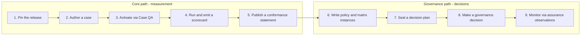

# Adoption Guide

- Status: current
- Purpose: the shortest compliant route from “nothing” to a conforming case,
  run, scorecard, and conformance claim. It does not weaken any normative
  requirement; it only orders and stages them.

The standard is large on purpose: it covers everything from a single case to
governance-grade autonomy decisions. You do not need to consume it linearly.
There are two adoption paths, and they build on each other:

Conformance is claimed per target, not globally. You can be case-conformant
today and decision-conformant never. That is not “partial conformance”: every
claim names exactly the targets it covers, and unsupported requirements are
either omitted from the claim or listed as deviations with claim
restrictions ([Conformance Contract](conformance.md)).

## Core path (measurement)

### 1. Pin the release

Choose a tagged release (`v0.1.0`) and record:

- the tag and Git commit;
- the contract versions from [`versions.json`](../versions.json);
- the semantic-validation version.

Every artifact you produce later references these pins. Saying “based on” the
standard is not a conformance claim.

### 2. Author a case

Read [Case Lifecycle Requirements](standard.md#case-lifecycle-requirements) in
the Golden Standard, then produce a `case.json` that satisfies
[`schemas/case.schema.json`](../schemas/case.schema.json). The fastest way is
to copy [`examples/case.json`](../examples/case.json) and replace the
placeholders.

A case is ready to enter QA only when it has: a pinned base snapshot; a task
description with no ticket IDs or solution hints; hidden checks; a risk tier;
contamination metadata and a canary; an interaction mode; and an inventory of
its [material decision surfaces](standard.md#conditional-decision-surface-coverage).

Checklist:

- [ ] `case.json` validates against the case schema
- [ ] task description is self-contained and contains no oracle hints
- [ ] reference and hidden material are unreachable from the agent-visible tree
- [ ] risk tier, ambiguity label, owner, and review date are assigned
- [ ] every decision surface has `checked`, `covered_by_final_state`,
      `not_applicable`, or an explicit `coverage_gap` with a claim restriction

### 3. Activate via Case QA

Before a case may enter `active`, run the
[Case QA Playbook](case-qa-playbook.md) stages and record the result in a
`case-qa-record.json` ([`schemas/case-qa-record.schema.json`](../schemas/case-qa-record.schema.json),
example: [`examples/case-qa-record.json`](../examples/case-qa-record.json)).

The minimum evidence for activation is: the reference solution passes a
runner-owned control run; a known-bad control fails; policy gates have
positive controls; no trivial strategy succeeds; at least one non-reference
solution passes hidden checks; FP/FN validation passes; and no severity-2+
defect is open.

The semantic validator checks the record before the case loader permits
`active`; the record cannot be deferred.

### 4. Run and emit a scorecard

One run = one sealed case set + one agent configuration + one scorecard
([`schemas/scorecard.schema.json`](../schemas/scorecard.schema.json),
example: [`examples/scorecard.json`](../examples/scorecard.json)).

Before the first trial, seal the pre-run manifest and anchor the attempt
ledger. After the run, the scorecard must show, in order: validity, hard-gate
and governance statuses; the primary outcome per trial; metrics and cost;
provenance. Schema validation is necessary but not sufficient: the
[Integrity and Semantic Validation Contract](integrity-and-semantic-validation.md)
recomputes hashes, formulas, ledger continuity, and verdict implications.

A development-run scorecard supports capability iteration but not release or
autonomy decisions; those require a `held-out` set and a sealed decision plan.

### 5. Publish a conformance statement

Publish a signed statement
([`schemas/conformance-statement.schema.json`](../schemas/conformance-statement.schema.json),
example: [`examples/conformance-statement.json`](../examples/conformance-statement.json))
that names the release pin, the targets it covers, typed evidence locations
and hashes, deviations with claim restrictions, and the issuer identity. An
unsigned statement is an unauthenticated self-assertion.

You can claim `case`, `evaluator`, or `run` conformance independently.
`evaluator` additionally requires the implementation to enforce I1-I13, the
baseline gate registry, and the trust boundary; `run` additionally requires a
schema-valid scorecard and complete evidence ledger.

## Governance path (decisions)

### 6. Write policy and matrix instances

The bundled [Governance Policy](governance-policy.md) and
[Escalation and Stop Matrix](escalation-stop-matrix.md) are deliberately
non-operational templates: no thresholds, no owners, no SLAs. Before any
held-out, release, or autonomy decision, publish an adopter-owned instance
that fills the risk-tier table, the decision rules, the approval envelope, the
non-waivable registry, and every matrix column. Unset cells are deliberate
blockers: a governance decision cannot cite the template as operational.

### 7. Seal a decision plan

Before the held-out or release run, record an immutable decision plan (ID,
hash, timestamp) with the exact evidence level, pass^k/pass@k requirements,
thresholds, zero-tolerance gates, expected governance statuses, and explicit
approve/reject/insufficient-evidence conditions.

### 8. Make a governance decision

Decisions use [`schemas/governance-decision.schema.json`](../schemas/governance-decision.schema.json)
(example: [`examples/governance-decision.json`](../examples/governance-decision.json))
and the [decision-record template](../templates/governance-decision-record.md).
An approval additionally binds a post-decision assurance plan. Resolutions,
waivers, renewals, and rollbacks are appended to the signed
governance-resolution ledger; the scorecard itself is immutable.

### 9. Monitor via assurance observations

Every expected monitoring window appends a typed assurance observation
(`assurance-observation.schema.json`). Missing, late, or unauthenticated
evidence triggers `assuranceEvidenceMissing` and suspends the affected
approval.

## Frequently used rules

- **Pre-registration (I3).** Everything that decides a verdict - case set,
  thresholds, gates, statistical plan, success definition - is sealed before
  the run and cannot be changed after results are observed.
- **Non-compensation (I1).** An acceptance, security, or policy violation
  cannot be offset by quality, cost, or composite scores.
- **Fail closed (I10).** An indeterminate gate or blocker is not a silent pass.
- **Evidence bounds claims (I6).** Positive, comparative, and autonomy claims
  are limited to the pre-declared target population, strata, and statistical
  plan; `insufficient_evidence` is a verdict, not a failure.

## What the standard deliberately does not do

This repository provides no runner, grader, benchmark cases, certification,
or leaderboard. If you need those, this standard is the contract your
implementation should satisfy, not the implementation itself.
