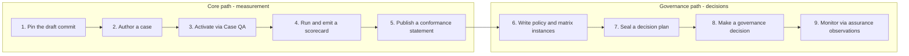

# Adoption Guide

- Status: current
- Purpose: the shortest route from “nothing” to a draft-conforming case, run,
  scorecard, and conformance claim. It does not weaken any normative
  requirement; it only orders and stages them.

The standard is large on purpose: it covers everything from a single case to
governance-grade autonomy decisions, and its requirements are partitioned
across a [requirements registry](requirements.md) and the primary documents
listed in the [README](../README.md#normative-authority-map). You do not need
to consume it linearly. There are two adoption paths, and they build on each
other:



Conformance is claimed per target, not globally. You can be case-conformant
today and decision-conformant never. That is not “partial conformance”: every
claim names exactly the targets it covers, and unsupported requirements are
either omitted from the claim or listed as deviations with claim restrictions
([Conformance](conformance.md)).

## Local development

The repository validates itself with Node tooling:

```bash
npm ci
npm run check        # repository consistency: schemas, generated artifacts, links
npm test             # full corpus: fixtures, vectors, and verifier tools
npm run release:check  # pre-publication gate (freshness + tests + evidence readiness)
```

Machine-verifiable expectations are captured as positive and negative
[conformance fixtures](../conformance/fixtures/) and verified by `npm test`.
If you change a schema or a normative requirement, add or update fixtures and
run `npm test` in the same pull request.

## Core path (measurement)

### 1. Pin the draft

The standard is an unpublished `0.1.0` candidate. Record the exact commit and
the version `0.1.0`; after publication you must additionally pin the protected
annotated tag `v0.1.0`. Every artifact you produce later references these pins.
Saying “based on” the standard is not a conformance claim.

### 2. Author a case

Read [Case Lifecycle Requirements](standard.md#case-lifecycle-requirements)
and the [Case Authoring requirements](requirements.md) in the Golden Standard,
then produce a `case.json` that satisfies
[`schemas/case.schema.json`](../schemas/case.schema.json).

A case binds exactly one effective [evaluation profile](../profiles/), one
outcome profile per eligible cell, one or more capability families with mapped
work-artifact types, an applicability contract, a Git workspace manifest, a
claim registry, and a sealed risk assessment. The bundled executable profiles
are `repo-change-v1` and read-only `repository-review-v1`; they demonstrate
interoperability mechanics, not empirical validity.

Checklist:

- [ ] `case.json` validates against the case schema
- [ ] the resolved evaluation profile and outcome profile are bound with digests
- [ ] every capability family has at least one material mapped work-artifact type
- [ ] the Git workspace is sealed with oracle-isolated state and visible-history closure
- [ ] risk assessment, inherent risk tier, leakage controls, and contamination
      metadata are recorded
- [ ] every decision surface is `checked`, `covered_by_final_state`,
      `not_applicable`, or an explicit declared gap with claim restrictions
- [ ] every claim in the claim registry resolves

### 3. Activate via Case QA

Before a case may enter `active`, run the [Case QA Playbook](case-qa-playbook.md)
stages and record the result in a `case-qa-record.json`
([`schemas/case-qa-record.schema.json`](../schemas/case-qa-record.schema.json)).

The minimum evidence for activation is: the reference solution passes a
runner-owned control run; a known-bad control fails; policy gates have
positive controls; no trivial strategy succeeds; at least one non-reference
solution passes hidden checks; FP/FN validation passes; and no blocking defect
is open. The semantic validator checks the record before the case loader
permits `active`; the record cannot be deferred.

### 4. Run and emit a scorecard

One run = one sealed case set + one agent configuration + one scorecard
([`schemas/scorecard.schema.json`](../schemas/scorecard.schema.json)).

Before the first trial, seal the pre-run manifest, the statistical plan, the
risk assessment, and the scheduled-cell commitment. After the run, the
scorecard must show, in order: validity, hard-gate and governance statuses;
claims and claim results; per-case results; metrics and cost; provenance.
Schema validation is necessary but not sufficient: the
[Integrity and Semantic Validation Contract](integrity-and-semantic-validation.md)
recomputes hashes, formulas, ledger continuity, verdict implications, and
outcome replay for claim-bearing cells.

A diagnostic or development run supports capability iteration but not release
or autonomy decisions; those require the sealed `held-out` exposure budget and
a decision plan.

### 5. Publish a conformance statement

Publish a signed statement
([`schemas/conformance-statement.schema.json`](../schemas/conformance-statement.schema.json))
that names the version and commit pins, the targets it covers, typed evidence
locations and hashes, deviations with claim restrictions, and the issuer
identity. An unsigned statement is an unauthenticated self-assertion.

You can claim `case`, `evaluator`, or `run` conformance independently.
`evaluator` additionally requires the implementation to enforce the invariant,
gate, evidence, and trust-boundary requirements registered for the evaluator
target; `run` additionally requires a schema-valid scorecard and complete
evidence ledger.

## Governance path (decisions)

### 6. Write policy and matrix instances

The bundled [Governance Policy](governance-policy.md) and
[Escalation and Stop Matrix](escalation-stop-matrix.md) are deliberately
non-operational templates: no thresholds, no owners, no SLAs. Before any
held-out, release, or autonomy decision, publish an adopter-owned instance
(`operational-governance-policy.schema.json`,
`operational-escalation-matrix.schema.json`) that fills the risk-tier table,
the decision rules, the approval envelope, the non-waivable registry, and every
matrix column. Unset cells are deliberate blockers: a governance decision
cannot cite the template as operational.

### 7. Seal a decision plan

Before the held-out or release run, record an immutable decision plan (ID,
hash, timestamp) with the exact evidence level, pass^k/pass@k requirements,
thresholds, zero-tolerance gates, expected governance statuses, and explicit
approve/reject/insufficient-evidence conditions.

### 8. Make a governance decision

Decisions use [`schemas/governance-decision.schema.json`](../schemas/governance-decision.schema.json)
and the [decision-record template](../templates/governance-decision-record.md).
An approval additionally binds a post-decision assurance plan. Resolutions,
waivers, renewals, and rollbacks are appended to the signed
governance-resolution ledger; the scorecard itself is immutable.

### 9. Monitor via assurance observations

Every expected monitoring window appends a typed assurance observation
(`assurance-observation.schema.json`). Missing, late, or unauthenticated
evidence triggers `assuranceEvidenceMissing` and suspends the affected
approval.

## Frequently used rules

- **Pre-registration (I3).** Everything that decides a verdict - case set,
  thresholds, gates, statistical plan, success definition - is sealed before
  the run and cannot be changed after results are observed.
- **Non-compensation (I1).** An acceptance, security, or policy violation
  cannot be offset by quality, cost, or composite scores.
- **Fail closed (I10).** An indeterminate gate or blocker is not a silent pass.
- **Evidence bounds claims (I6).** Positive, comparative, and governance claims
  are limited to the pre-declared target population, strata, and statistical
  plan; `insufficient_evidence` is a verdict, not a failure.
- **Evidence fits the construct (I9).** Claims are limited to the capability
  families and work-artifact types actually measured; incidental actions add
  no capability.

## What the standard deliberately does not do

This repository provides no evaluation runner, grader, benchmark cases,
certification, or leaderboard. If you need those, this standard is the contract
your implementation should satisfy, not the implementation itself.
