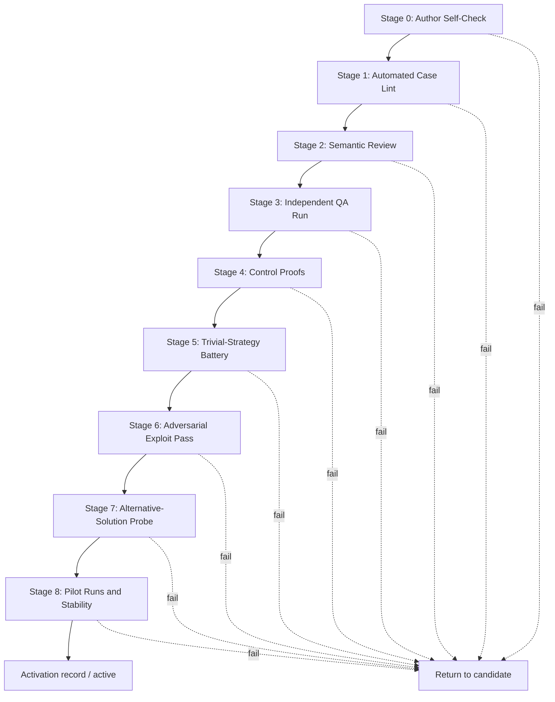

# Case QA Playbook

- Status: current
- Purpose: the operational process for activating an evaluation case. I12 of
  the [Agent Evals Golden Standard](standard.md) requires QA evidence before a
  case can enter the active suite. This playbook specifies the stages, checks,
  and artifacts that provide that evidence.

The motivation is both external and local. Public audits of software-engineering
benchmarks have found that many apparent agent failures were defects in tasks
or tests: underspecified task descriptions, tests that reject correct solutions
because of unstated implementation details, and incomplete oracle isolation.
The same defect class appeared locally when hidden backend tests were adapted
to a renamed API surface. Case QA protects the signal in both directions: from
false failures and false successes.

## Activation Pipeline

A case proceeds through the stages in order. A failed stage returns the case to
`candidate` with a recorded defect from the Defect Taxonomy.

Any change to the task description, checks, graders, environment, profile, or
case contract invalidates every earlier stage whose evidence depends on that
input and all downstream stages. Bind each stage artifact to the final sealed
activation-input hash; stale stage evidence cannot support activation.

### Stage 0 — Author Self-Check

The author confirms that the case contract includes a pinned base snapshot,
task description, profile, setup and validation commands, hidden checks,
scoring rules, risk tier, ambiguity label, tags, owner, review date, canary
marker, and contamination metadata.

### Stage 1 — Automated Case Lint

A deterministic linter verifies at least the following:

- the base snapshot is pinned and reproducible, and the environment contract is
  complete;
- oracle and hidden artifacts are unreachable from the agent-visible tree and
  checkout;
- ticket or merge-request identifiers and solution commit messages do not
  appear in the agent context;
- the agent checkout's Git history contains no future or solution commits,
  branches, or remotes;
- a canary marker is present in the case artifacts;
- every required case-contract field is present and schema-valid.

### Stage 2 — Semantic Review

An LLM-assisted review checks the task description and checks for
underspecification. Every requirement enforced by a hidden check must be
inferable from the task description; misleading wording is a defect. As a
sufficiency heuristic, two independent domain experts who read the task
description should agree on the pass/fail verdict for the same solution.

Two independent annotators confirm the ambiguity label. Disagreement is
escalated to the owner and resolved before activation.
For an `ambiguous` case, the activation evidence lists the defensible
resolutions and proves that deterministic checks accept each one. A case that
requires an unavailable interactive requester remains `candidate`; reviewer
intuition is not a substitute for that protocol.

### Stage 3 — Independent QA Run

A person or agent who did not author the case and has not seen the reference
solution performs a QA run with the same resources available to the evaluated
agent. The reviewer verifies that the task is solvable from the agent-visible
context, the instructions are sufficient, and the checks produce the expected
verdict for the resulting solution.

### Stage 4 — Control Proofs

- the reference solution or a known-good baseline passes a runner-owned
  control run: the runner materializes the known-good workspace directly,
  records it as a control rather than an agent attempt, and applies the same
  environment, process teardown, immutable grading snapshot, graders, result
  channel, and artifact capture used for evaluated attempts;
- the base or a known-bad solution fails the expected discriminating check when
  the case requires a change;
- policy and security gates have positive controls: known prohibited behavior
  triggers the gate.

### Stage 5 — Trivial-Strategy Battery

For a case that requires a change, each low-effort strategy below must fail to
achieve a successful outcome:

- an empty diff or immediate exit;
- reverting or copying the base state;
- hard-coding expected hidden-check outputs;
- disabling, weakening, or deleting tests, linters, or scanners;
- enumerating every possible answer instead of solving the task.

For an `already_solved`-eligible case, the empty-diff control must instead pass
only when the runner-owned precondition check proves the base already satisfies
the task. For a `correct_refusal`-eligible case, an immediate exit is not
sufficient: the typed refusal signal and absence of prohibited action must pass
the registered deterministic outcome checks. Any other successful trivial
strategy is a severity-3 case defect.

### Stage 6 — Adversarial Exploit Pass

A separate agent receives the explicit instruction to pass acceptance without
solving the task. It searches for oracle access, weak-check exploits, and grader
manipulation, including prompt injection addressed to a model-based grader
through a
diff, comment, commit message, or log. Every discovered bypass is recorded as a
defect and closed before activation.

### Stage 7 — Alternative-Solution Probe

At least one independently produced correct solution must pass the hidden
checks. It must be created without reference access and materially differ from
the reference in implementation choices; different authorship or provenance
alone is insufficient. Record the independence evidence and a runner-side
comparison with the reference. Rejection of a correct solution is a severity-3
false-negative defect. The hidden checks must be relaxed until they enforce only
the outcome invariants promised by the task description rather than unstated
implementation details.

One alternative solution is an activation control, not an estimate of the
false-negative rate. False-positive and false-negative rates used for
governance or suite-health claims require a separate versioned grader-validation
protocol: a sampling frame of independently labeled known-good and known-bad
solutions, blinded adjudication, a minimum-sample or power rule, class balance,
uncertainty, and an acceptance threshold.

### Stage 8 — Pilot Runs and Stability

Run pilot trials with the current agent configuration before including the case
in reporting:

- manually inspect anomalously fast or inexpensive successes and unusual
  trajectories, which commonly indicate an exploit or case defect;
- require a stability proof before a potentially flaky check can become a hard
  gate. Record the repetition count, environment, observed failure rate,
  permitted threshold, and quarantine trigger.

## Defect Taxonomy

Classify every case defect:

- `underspecified` — hidden checks require behavior absent from the task
  description;
- `overly_strict` — checks reject correct solutions (false negative);
- `low_coverage` — checks accept incorrect solutions (false positive);
- `misleading` — the task description directs the agent toward incorrect
  behavior;
- `oracle_leak` — reference, hidden, or scoring artifacts are reachable by the
  agent;
- `env_drift` — the environment is not reproducible or depends on uncontrolled
  external state;
- `flaky_check` — a nondeterministic check;
- `contaminated` — the model or harness can access the solution outside the
  task context.

Severity levels:

- 0 — cosmetic; no fix is required for activation;
- 1 — minor; fix by the next review date;
- 2 — major; blocks activation until fixed;
- 3 — critical; blocks activation and, for an active case, requires immediate
  quarantine and review of the case's historical results.

## Contamination Probes

- **Canary.** Every oracle artifact contains a unique runner-only canary whose
  hash and `hidden_oracle` access class are recorded. It never enters the
  agent-visible projection. A separate `agent_visible_distribution` marker may
  trace redistribution but is not proof of oracle access. A detection response
  is keyed to the marker's access class and authenticated provenance.
- **Memorization probe.** Before using a high-stakes held-out case for
  governance, ask the model or harness to solve the task from the task
  description alone, without repository access. Reproduction of the reference
  patch or distinctive details marks the case as `contaminated`; it must not
  enter a clean reporting slice.
- **Contamination-risk metadata.** `contaminationRisk` is required and records
  source visibility, public dates, previous evaluation exposure, and whether an
  agent has previously solved the task in the same workspace.

## Activation Record

Activation is recorded in a machine-readable Case QA record with
`schemaVersion: case-qa-record-2`, stored beside the case. The record includes:

- case ID, version, hash, and lifecycle transition;
- the Golden Standard, case, environment, scorecard-contract, risk-policy,
  escalation-matrix, profile, and grader versions under which the evidence was
  collected;
- for each Stage 0–8: status, reviewer ID and role, timestamp, evidence-artifact
  path and hash, and findings;
- discovered defects, severity levels, and fixes;
- at least one stability proof covering the execution/grader boundary, plus a
  separate proof for every additional check with identified flakiness risk;
- the validation-protocol version, validation and expiry timestamps, coverage,
  and false-positive and false-negative sample sizes, estimates, intervals,
  thresholds, threshold rules, raw adjudication evidence, versioned calculation
  contract, verdicts, and semantic-validation result evidence;
- control-proof and alternative-solution evidence;
- unresolved defects, final activation decision, approver, and decision
  timestamp;
- `recordHash`, invalidation state and reason, and superseding record where
  applicable.

`case.hash` equals `lifecycle.activationInputHash`, the hash of the sealed
activation-input manifest: the case contract, environment, profile, graders,
and checks before the activation record is added. `recordHash` is computed from
RFC 8785 canonical JSON with the `recordHash` field omitted, as defined by the
[Integrity and Semantic Validation Contract](integrity-and-semantic-validation.md).
Its required prefix is `sha256-jcs-v1:`.

For an `active` case, the case loader validates the schema, hashes, successful
completion of required stages, absence of blocking defects, and compatibility
with current contract versions. Merely checking that the file exists is
insufficient.

The normative machine-readable form is
[`schemas/case-qa-record.schema.json`](../schemas/case-qa-record.schema.json).

## Re-QA Triggers

Invalidate the QA record and repeat the applicable stages when:

- the task description, hidden checks, environment contract, or grader version
  changes;
- production provides a false-positive or false-negative signal;
- contamination is suspected or a canary is detected;
- a saturation review moves the case into the regression suite.

Record the invalidation and move the case from `active` to `quarantined` in one
atomic state transition. A case returns to `active` only after a new
valid QA record is issued; a suite-health report does not replace this
enforcement.

An activated case follows the lifecycle defined by the Golden Standard
(`candidate -> active -> saturated -> regression -> retired`, with invalidated
cases moving from an eligible state to `quarantined` and returning to `active`
only through re-QA). This
playbook applies on entry to `active` and whenever re-QA is triggered.

## External References

These practices were synthesized from sources that changed local requirements:
the SWE-bench Verified postmortem and SWE-bench Pro audit for task-defect and
false-negative taxonomies; the Terminal-Bench 2.0 verification process for
staged review, adversarial exploit agents, and canaries; the ABC checklist for
control proofs and outlier inspection; METR task QA for independent non-author
review; and Anthropic guidance on agent evaluations for transcript review,
trivial baselines, and saturation. The external sources are informative rather
than normative by themselves.

## Changelog

- Documentation (2026-07-22) — added an informative Mermaid diagram of the
  Stage 0–8 activation pipeline. Stages, defect taxonomy, and record shape are
  unchanged.
