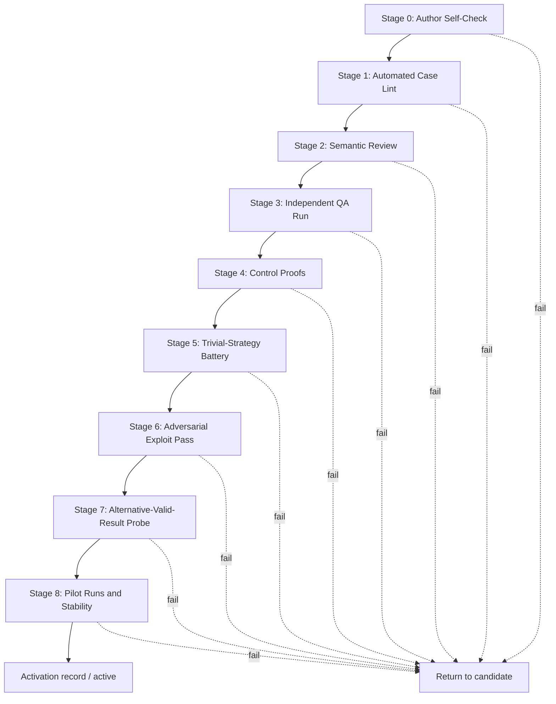

# Case QA Playbook

- Status: unpublished working draft
- Contract version: 0.1.0
- Purpose: the operational process for activating an evaluation case. I12 of
  the [Git-backed Repository SDLC Agent Evals Standard](standard.md) requires QA evidence before a
  case can enter the active suite. This playbook specifies the stages, checks,
  and artifacts that provide that evidence.

The motivation is practical. Public audits of software-engineering
benchmarks have found that many apparent agent failures were defects in tasks
or their verdict mechanisms: underspecified task descriptions, checks or
adjudication that reject valid results because of unstated requirements, and
incomplete oracle isolation.
Case QA protects the signal in both directions: from false failures and false
successes.

## Activation Pipeline

A case proceeds through the stages in order. A failed stage returns the case to
`candidate` with a recorded defect from the Defect Taxonomy.

```mermaid
flowchart TD
  s0[Stage 0: Author Self-Check] --> s1[Stage 1: Automated Case Lint]
  s1 --> s2[Stage 2: Semantic Review]
  s2 --> s3[Stage 3: Independent QA Run]
  s3 --> s4[Stage 4: Control Proofs]
  s4 --> s5[Stage 5: Trivial-Strategy Battery]
  s5 --> s6[Stage 6: Adversarial Exploit Pass]
  s6 --> s7[Stage 7: Alternative-Valid-Result Probe]
  s7 --> s8[Stage 8: Pilot Runs and Stability]
  s8 --> active[Activation record / active]

  s0 -.->|fail| cand[Return to candidate]
  s1 -.->|fail| cand
  s2 -.->|fail| cand
  s3 -.->|fail| cand
  s4 -.->|fail| cand
  s5 -.->|fail| cand
  s6 -.->|fail| cand
  s7 -.->|fail| cand
  s8 -.->|fail| cand
```

Any change to the task description, agent-visible projection, checks, graders,
environment, profile, statistical plan, or case contract invalidates every
earlier stage whose evidence depends on that input and all downstream stages.
Each stage artifact **MUST** bind the final sealed activation-input hash; stale
stage evidence **MUST NOT** support activation.

Each stage requires a review capability, not a particular implementation
technology. The activation record **MUST** bind the exact
`reviewerCapabilityId`, accountable reviewer authority, and
`implementationKind`. A `qualified_human`, `deterministic_system`, or
`agent_system` **MAY** supply a capability when it meets the same qualification,
input-isolation, evidence, and failure requirements. Choosing an implementation
kind never waives a check. A stage that invokes a deterministic recomputation or
an independent human label still requires that evidence regardless of which
implementation coordinates the stage.

The capability IDs are closed and stage-specific: `case_author_self_check`,
`case_contract_lint`, `case_semantic_review`, `independent_case_execution`,
`verdict_control_verification`, `trivial_strategy_testing`,
`adversarial_measurement_review`, `alternative_valid_result_validation`, and
`pilot_stability_validation` for Stages 0 through 8 respectively. A record with
the wrong capability at a stage is invalid even if its free-form evidence looks
plausible.

Before QA starts, the record **MUST** seal an `independenceBaseline` containing
every case author, reference or primary-result producer, verdict-mechanism
owner, and any applicable evaluated-system developer or prior-QA-result owner.
Each authority binds an actor ID, role, trust domain, key ID, and public-key
digest. Stage 3, Stage 6, and Stage 7 **MUST** name every baseline actor in a
machine-readable independence claim and differ from each one on all five
dimensions. Those three reviewers **MUST** also differ from one another on all
five dimensions; Stage 7's reviewer and alternative-result producer have the
same separation requirement. Renaming an actor, role, trust domain, or key
without changing the underlying authority does not establish independence.
Missing, duplicate, unresolved, or unauthenticated independence evidence fails
closed.

### Stage 0 — Author Self-Check

The author confirms that the case contract includes a content-addressed
workspace manifest with one selected state binding per repository (`baseTree`
for `tree_snapshot`, or `baseRevision` and the declared history projection for
a commit-based mode), task
description, full agent-visible projection manifest, profile, setup and
validation strategy, scoring rules, risk tier, ambiguity label, tags, owner,
review date, leakage-control declaration, and contamination metadata. Each
protected oracle domain selects a runner-only canary only when it can be
embedded safely; otherwise it selects authenticated access telemetry or a
semantically matched decoy. The strategy covers
public checks, hidden checks, security checks, and control proofs exactly once.
Each class is either `checked` with a nonempty check set or `not_applicable` with
an authenticated applicability rule and evidence; an unknown result is invalid.
The author also inventories every material decision surface, registers the
closed claim IDs it is permitted to support in `claimRegistry`, binds the
authenticated work-artifact registry, selects exactly one supported
`interactionModeId`, and, when that mode requires interaction, pins the typed
actor protocol and simulator components.

The projection manifest **MUST** enumerate every file, history view, visible
test, document, tool response, policy, network source, and generated context
available to the evaluated agent, with its digest or deterministic capture
rule. It **MUST** classify hidden checks, reference results, canaries, grader
prompts, QA findings, and adjudication data as runner-only.

When the selected outcome profile uses replay-time path classification, Stage 0
**MUST** record `classificationPolicyApplicability`. It binds the exact outcome
profile, classification-policy contract, replay executor, applicability rule,
repository-convention manifest digest, and complete activation-time material-
path-frame digest.
The classified-path count **MUST** equal the material-path count, with zero
unknown paths and zero classification collisions, before the result may be
`applicable`. An unknown convention, ambiguous or colliding class, uncovered
material path, unresolved evidence, or mismatched policy/executor is
`insufficient_evidence` and makes Stage 0 fail. `not_applicable` requires an
authenticated rule proving that the selected outcome profile performs no such
classification; a claimant assertion is insufficient.

For an applicable replay policy, the validator **MUST** resolve the outcome
profile, semantic contract, executor, and applicability-rule pointers from the
fixed distribution-owned outcome-replay registry and compare every ID, version,
URI, and digest exactly. The applicability and coverage evidence **MUST** use
the typed `case-qa-classification-applicability-evidence-1` payload. That payload
binds the case and activation-input digest, the exact registry graph, the
repository-convention manifest from the sealed activation input, the complete
activation-time material-path frame, and one convention-supported
classification per path. Every material path is carried as the raw, safe Git
path plus its repository ID and exact UTF-8-byte digest. Every convention
carries its selector definition in the closed selector language, not only an
opaque selector hash. The validator resolves the frame independently from the
sealed activation input, compares it exactly, recomputes the selector, manifest,
and path-set digests, executes every selector, executes the exact classifier
whose source digest is registered for the outcome profile, and requires the
claimed matched conventions and class to equal that derived result. A generic
signed blob, self-declared count, self-consistent selector/class relabeling,
matching ID with a substituted digest, or evidence for a different case is
insufficient.

The trusted frame resolver **MUST NOT** obtain selectors or paths from the Stage
0 evidence it is validating. It resolves paths from the sealed activation-input
closure and authenticates selector definitions under the repository owner or a
pre-authorized measurement-governance authority. Authorization is fixed outside
the case author's and Case QA evidence producer's control; an otherwise valid
signature from either actor does not make substituted selectors trusted.

Stage 0 occurs before evaluation trials exist. Therefore this frame is the
complete set of material paths available for activation-time applicability
checking and is included in the sealed activation-input manifest identified by
`case.activationInputDigest`; it is not evidence about a future trial's actual
workspace diff. At replay, the trusted executor **MUST** independently parse the
authenticated workspace-diff bytes, derive the actual changed-path set, and run
the same registered classifier on every actual path. A Stage 0 frame or verdict
**MUST NOT** substitute for that trial-time check.

### Stage 1 — Automated Case Lint

A deterministic linter verifies at least the following:

- the workspace manifest's canonical digest matches its content-addressed
  locator; repository IDs and paths are unique; and the named repository-state
  verifier passes the selected mode for every root. A `tree_snapshot` has a
  `baseTree`, no commit base, and no refs or commit objects. A
  `bounded_ancestry` or `full_ancestry` projection has a `baseRevision` equal to
  its own `cutoffRevision`, exact permitted refs and object closure, and, for
  bounded ancestry, the declared parent-depth boundary. The snapshot is
  reproducible. The environment contract has an explicit closed input origin,
  and any production-derived input passes the environment contract's subject-
  binding and pre-run-seal checks;
- oracle and hidden artifacts are absent from the agent-visible tree, checkout,
  Git objects and refs, caches, indexes, build layers, environment variables,
  tool responses, logs, retrieval stores, network mounts, provider state, and
  inherited sessions;
- hidden-oracle ticket or merge-request identifiers, solution-lineage
  identifiers, and solution commit messages do not appear in the agent
  context. A task or pull-request identifier explicitly declared in the
  agent-visible projection remains permitted;
- the agent checkout contains no future or solution commits and no refs,
  branches, or remotes outside the selected repository-state projection.
  `tree_snapshot` exposes none; a commit-based mode exposes only its sealed
  local base branch ref;
- every oracle domain uses at least one validated leakage control: a runner-only
  canary when it can be embedded without changing semantics or signed/byte-exact
  content, otherwise authenticated access telemetry or a semantically matched
  decoy; the linter verifies that control values and reversible encodings do not
  enter a visible projection, prompt, manifest, log, or report;
- every required case-contract field is present and schema-valid; the case,
  effective evaluation profile, and outcome profile bind one registry; every
  material work-artifact type maps to its declared family; and every selected
  family has at least one material mapped type;
- every validation class has one authenticated applicability determination; the
  linter executes its rule over the bound evidence, requires `checked` exactly
  when applicable and `not_applicable` exactly when inapplicable, and rejects an
  unknown result or an author-edited projection;
- decision-surface IDs and actor IDs are unique; every check reference resolves;
  an interactive protocol has exactly one evaluated agent; and the sealed
  clarification policy references that protocol.
- an activated Case QA record resolves every decision-surface ID through its
  pinned case hash and preserves the sealed coverage mode and, for a declared
  gap, the exact typed claim restriction; no post-hoc `not_applicable` or
  `declared_gap` reclassification is permitted.

### Stage 2 — Semantic Review

The accountable reviewer exercising the `case_semantic_review` capability
checks the complete sealed agent-visible projection and every applicable
verdict mechanism for underspecification. Hidden checks are
one possible mechanism, not a universal requirement. When their applicability
rule returns `not_applicable`, the reviewer verifies that authenticated result;
a self-declared empty array is not sufficient. Every requirement enforced by a
deterministic check or adjudication rubric **MUST** be inferable from that
projection: task text, pinned repository state, visible tests and documentation,
applicable policy, and deterministic tool or environment behavior. The
requirement **MUST NOT** depend only on the reference result, hidden grader
rationale, author intent, or post-run knowledge.

For each enforced requirement, the reviewer records a trace from the check ID
to the exact projection artifact, digest, and location that establishes it, plus
the permitted outcome invariant. Missing or conflicting trace evidence is an
`underspecified` defect. As a sufficiency heuristic, two independent domain
experts given the same sealed projection **SHOULD** agree on the verdict for the
same candidate result.

Two independent annotators confirm the ambiguity label. Disagreement is
escalated to the owner and resolved before activation.
This two-person floor is a fail-closed defense against a single-rater failure,
not an empirically universal optimum. The sealed reliability target, effective
risk, and observed agreement **MAY** require more reviewers and **MUST NOT**
justify fewer for decision-bearing expert evidence.
For an `ambiguous` case, the activation evidence lists the defensible
resolutions and proves that each one is accepted by the evidence mode selected
by the bound outcome profile. A case that requires an unavailable interactive
requester remains `candidate`; reviewer intuition is not a substitute for that
protocol.
The review challenges every `covered_by_final_state` assertion. A material
`declared_gap` records its typed claim restriction and prevents the activation
evidence from supporting every affected claim; indeterminate applicability fails closed as
`insufficient_evidence`.

### Stage 3 — Independent QA Run

The reviewer exercising the `independent_case_execution` capability and
satisfying the sealed independence baseline has not seen the protected reference
result, applicable hidden checks, grader rationale, prior QA outputs, or
evaluated-agent results. That reviewer performs a QA run with exactly the sealed
agent-visible projection and the same resource policy available to the
evaluated agent. The reviewer verifies that the task is solvable, instructions
are sufficient, and the outcome-profile-selected deterministic checks,
adjudication, or hybrid mechanism produces the expected verdict for the
resulting work artifact. The artifact may be a repository change or a read-only
review, assurance, incident-analysis, release, or other in-scope SDLC result.

The QA custodian **MUST** sequester the reference, hidden artifacts, validation
set, and QA findings from model, prompt, policy, harness, and grader developers.
QA evidence **MUST NOT** be used to tune the system being evaluated or its
grader. Fixing a case or measurement component creates a new activation-input
hash and repeats every affected stage. A model, prompt, policy, harness, or
grader exposed to held-out QA outcomes **MUST** record that exposure and those
cases **MUST NOT** remain its sole clean held-out evidence.

### Stage 4 — Control Proofs

- a reference result or other known-good result **MUST** pass a runner-owned
  control run. For a change result, the runner materializes the known-good
  workspace directly; for a read-only result, it supplies the sealed result
  artifact and its evidence packet directly. In both cases it records a control
  rather than an agent attempt and applies the same environment, process
  teardown, immutable grading snapshot, outcome-profile-selected verdict
  mechanism, result channel, and artifact capture used for evaluated attempts;
- a known-bad result **MUST** fail an applicable discriminating mechanism. The
  unchanged base may serve as that result when the case requires a change, but
  it is not a universal control for read-only work;
- policy and security gates **MUST** have positive controls: known prohibited
  behavior triggers the gate;
- each decision surface **MUST** have known-good and known-bad controls. A
  `checked` surface also has an alternate valid trajectory that passes; a
  `covered_by_final_state` surface has a proof that an incorrect material
  decision cannot hide behind an accepted final state.
  Each control records its input digest, bound verdict-mechanism IDs and
  component digests, expected and observed verdicts, and execution evidence; a
  label without a recomputable execution is not a control proof.

### Stage 5 — Trivial-Strategy Battery

For a case that requires a change, each low-effort strategy below **MUST** fail to
achieve a successful outcome:

- an empty diff or immediate exit;
- reverting or copying the base state;
- hard-coding expected hidden-check outputs;
- disabling, weakening, or deleting tests, linters, or scanners;
- enumerating every possible answer instead of solving the task.

For an `already_satisfied`-eligible case, the empty-diff control **MUST** instead pass
only when the runner-owned precondition check proves the base already satisfies
the task. For a `correct_refusal`-eligible case, an immediate exit is not
sufficient: the typed refusal signal and absence of prohibited action **MUST** pass
the registered deterministic outcome checks. Any other successful trivial
strategy is a severity-3 case defect.

For a read-only result, the sealed battery **MUST** reject every applicable
low-effort substitute, including an empty or evidence-free artifact, generic
boilerplate unrelated to the pinned repository state, unsupported findings,
and omission of a material required conclusion. The outcome profile determines
which deterministic checks, expert adjudication, or hybrid verdict applies;
the case author cannot replace that selection after observing QA results.

### Stage 6 — Adversarial Exploit Pass

The reviewer exercising the `adversarial_measurement_review` capability and
satisfying the sealed independence baseline is tasked with achieving acceptance
without producing a valid result. The reviewer searches for oracle access,
weak-verdict exploits, and grader manipulation, including prompt injection
addressed to a model-based grader through a diff, review artifact, comment,
commit message, or log. Every discovered bypass is recorded as a defect and
closed before activation.

When a model grader is enabled, Stage 6 binds an unexpired
`grader-validation-1` record. The validation population and sampling frame
**MUST** cover the case's task family, outcome classes, risk tier, languages,
artifact formats, and adversarial conditions. The protocol **MUST** seal a
power or minimum-sample rule, independent human-label process, class prevalence
or balancing rule, adjudication, acceptance thresholds, and expiry before
labels or grader outputs are inspected.

For every enabled model grader, the judge-bias suite **MUST** contain exactly one
passing control for each closed class `identity`, `position`, `verbosity`,
`style`, `reference_anchoring`, `prompt_injection`, and `judge_family`.
Additional `other` controls **MAY** cover a named risk but cannot replace any
closed class. The suite also **MUST** test, where applicable, reasoning-demand
failures, domain and risk strata, and calibration drift. It **MUST** report class- and
stratum-specific false-positive and false-negative estimates, uncertainty,
human disagreement, and missingness. `breach` or `insufficient_evidence` blocks
that grader use. Model graders remain auxiliary and require human-labeled
calibration.
Every grader-control ID **MUST** be unique within the validation record; two
records with the same ID are a duplicate even when their other fields differ.

A shared validation record **MAY** support multiple cases only when every case
falls inside its sealed sampling frame and validity window and uses the exact
grader, prompt, rubric, parser, and calculation digests. Reuse outside that
scope or after tuning, drift, or expiry **MUST** fail closed.

For every interactive model simulator, Stage 6 probes goal persistence,
required disclosure, terminal behavior, refusal boundaries, and collusion with
the evaluated agent. Stage 8 establishes simulator stability and variance with
declared sampling units, strata, seeds, repetitions, estimates, uncertainty,
thresholds, raw evidence, and versioned calculation contracts.
Failure or insufficient evidence keeps the case `candidate`.
Every simulator actor has its own component-bound validation record.
Interactive QA also verifies the evaluated-agent responsibility predicate and
runs the no-op-agent/co-actor control; the control **MUST** fail to achieve success.

### Stage 7 — Alternative-Valid-Result Probe

By default, at least one independently produced material result that is valid under the
bound outcome profile **MUST** receive an accepted verdict from every applicable
required verdict mechanism. Hidden checks participate when their authenticated
case disposition is `checked`; when it is `not_applicable`, the selected
deterministic public, security, or control checks, expert adjudication, or hybrid
evidence mode serves instead.

The result's validity **MUST** first be established by evidence independent of
the verdict mechanism under test. If the outcome profile selects expert
adjudication as the production verdict, a separate blinded qualified
adjudication or deterministic construction proof establishes the control's
known-valid status. The result **MUST** be produced without protected reference
access and materially differ from the reference or primary known-good result in
a dimension relevant to its work-artifact type—for example implementation,
reasoning path, evidence selection, finding set, or report structure—while
preserving the permitted outcome invariants. Different authorship, provenance,
wording, or formatting alone is insufficient. Record the selected
outcome-profile evidence-mode ID, independent validity evidence, independence
evidence, material-difference evidence, and runner-side comparison.
Rejection of a valid result is an `alternative_valid_result_rejected` severity-3
false-negative defect. The rejecting check or adjudication contract **MUST** be
corrected until it enforces only requirements traceable to the sealed
agent-visible projection and bound outcome profile.

Stage 7 **MAY** instead record `not_applicable` only when an authenticated,
pre-sealed applicability rule proves that the valid-result set contains exactly
one material equivalence class under the task's permitted outcome invariants.
Byte identity, a single reference implementation, author intent, or failure to
find an alternative is not a singleton proof. An unknown, incomplete, or
disputed result leaves the stage failed and the case `candidate`.

The `not_applicable` record **MUST** set `alternativeValidResult` to `null` and
bind all of the following in `singletonValidityProof`:

- the versioned applicability rule and valid-result-set definition sealed before
  inspecting the proof outcome;
- authenticated applicability, equivalence, and exhaustiveness evidence proving
  that every valid realization preserves the same material result and that no
  second material equivalence class is omitted;
- authenticated counterexample-search evidence produced under the Stage 7
  independence controls and designed to falsify the singleton claim;
- a runner-owned passing control for the canonical singleton result; and
- at least two distinct runner-owned failing near-miss controls on different
  input digests. Each near miss **MUST** exercise the exact check IDs and
  component digests used for the canonical control.

The canonical control protects against rejecting the only valid result; the
equivalence, exhaustiveness, counterexample, and near-miss evidence protect
against declaring a set singleton merely because the search or verdict
mechanism is weak. Missing, stale, unauthenticated, differently bound, or
post-hoc evidence makes `not_applicable` invalid.

One alternative valid result is an activation control, not an estimate of the
false-negative rate. False-positive and false-negative rates used for
governance or suite-health claims require the shared grader-validation protocol
defined in Stage 6. The validation sample **MUST** be independent of grader
tuning and **MUST** include hard, boundary, ambiguous, adversarial, and ordinary
examples from the declared frame.

### Stage 8 — Pilot Runs and Stability

Run pilot trials with predeclared, diverse probe configurations chosen to
exercise the case and measurement system's failure modes before including the
case in reporting. These probes are QA controls, not evaluated treatment arms;
case activation does not become specific to a later agent configuration merely
because that configuration was used as a probe:

- manually inspect anomalously fast or inexpensive successes and unusual
  trajectories, which commonly indicate an exploit or case defect;
- require a stability proof before a potentially flaky check can become a hard
  gate. Record the repetition count, environment, observed failure rate,
  permitted threshold, and quarantine trigger.
- verify that the runner preserves the append-only pre-transform event stream
  across compaction, summarization, tool-output clearing, and agent-authored
  memory; omission, rewriting, or reliance on those derived views is a blocking
  capture defect;
- for interactive cases, verify actor attribution, shared-state hashes,
  terminal rules, and zero unattributed mutations across repeated trials.

Before pilot or validation outcomes are observed, Stage 8 **MUST** bind an
`agent-eval-statistical-plan-1` covering every quantitative QA claim. The plan
**MUST** declare the estimand, target population, sampling frame and unit,
primary and exploratory endpoints, power or minimum-sample rule, estimator,
interval method, dependence, missingness and retry handling, multiplicity
control, sequential-look schedule and stopping rule, and held-out exposure and
reuse budget. Its bound sampling-frame contract **MUST** define the
probe-configuration selection rule. Every inspection of an unblinded held-out result counts as a look
and an exposure. An exploratory finding **MUST NOT** create or change a hard
gate without confirmation under a new sealed plan on unexposed evidence.

## Defect Taxonomy

Classify every case defect:

- `underspecified` — a verdict mechanism requires behavior not traceable to the
  sealed agent-visible projection;
- `overly_strict` — a verdict mechanism rejects valid results (false negative);
- `low_coverage` — a verdict mechanism accepts invalid results (false positive);
- `misleading` — the task description directs the agent toward incorrect
  behavior;
- `oracle_leak` — reference, hidden, or scoring artifacts are reachable by the
  agent;
- `env_drift` — the environment is not reproducible or depends on uncontrolled
  external state;
- `flaky_check` — a nondeterministic check;
- `measurement_boundary_bypass` — evaluation succeeds by modifying or escaping
  the sealed measurement boundary rather than producing the required result;
- `trivial_strategy_bypass` — an applicable low-effort substitute achieves an
  accepted outcome without the required work;
- `alternative_valid_result_rejected` — an independently produced, materially
  distinct valid result is rejected by an applicable verdict mechanism;
- `privacy_or_security_exposure` — case or QA operation exposes protected data,
  code, credentials, or exploitable security details;
- `contamination_suspected` — a pre-registered probe finds an anomalous exposure
  signal without authenticated proof of access;
- `contamination_confirmed` — an authenticated canary, access record, provider
  evidence, or equivalent provenance proves access to protected oracle content;
- `cosmetic` — a presentation defect that cannot affect task meaning, execution,
  verdicts, evidence, or claims.

Severity levels:

- 0 — cosmetic; no fix is required for activation;
- 1 — minor; fix by the next review date;
- 2 — major; blocks activation until fixed;
- 3 — critical; blocks activation and, for an active case, requires immediate
  quarantine and review of the case's historical results.

## Contamination Probes

- **Leakage control.** An oracle artifact **MUST** use a unique runner-only canary
  only when pre-release validation proves semantic inertness and preservation of
  signatures or byte-exact behavior. Otherwise the protected oracle domain
  **MUST** use authenticated access telemetry or a semantically matched decoy.
  Control digests, access class, and applicability evidence are recorded; a
  control **MUST NOT** enter the agent-visible projection. A separate
  `agent_visible_distribution` marker **MAY** trace authorized redistribution
  but is not proof of oracle access. Authenticated observation of a hidden
  canary or decoy, or unauthorized access in trusted telemetry, is
  `contamination_confirmed`. Absence of a signal does not establish absence of
  contamination.
- **Memorization probe.** A probe **MUST** pre-register the distinctive features,
  comparison statistic, negative controls, repetitions, false-alarm threshold,
  and affected scope. Reproduction of reference-only detail without provenance
  is `contamination_suspected`, not proof of access. Running a probe on a
  held-out case is itself an exposure and **MUST** consume its reuse budget.
  High-stakes governance **MUST** quarantine suspected cases until independent
  review resolves or excludes the signal; confirmed cases **MUST NOT** enter a
  clean reporting slice and trigger historical-claim review.
- **Contamination metadata.** The `contamination` object is required and records
  risk level, source visibility, public dates, previous evaluation exposure, and
  whether an agent has previously solved the task in the same workspace. It
  also records every probe exposure, status, evidence, resolver, affected
  model/harness scope, and disposition.

## Evidence Handling

Every QA artifact **MUST** use the canonical evidence record and detached
validation envelope defined by the
[Evidence and Detached Validation Contract](evidence-and-validation-contract.md).
The activation record **MUST NOT** embed or hash its own validation envelope.
Reference results, hidden checks, canaries, personal data, customer content,
licensed code, and exploitable security details **MUST** remain access
controlled; reports **MUST** use a digest, redacted extract, or authorized
pointer when raw bytes are unnecessary. Before QA, the owner **MUST** record
lawful authority, access roles, privacy/IP restrictions, retention, deletion or
legal-hold handling, and the effect of evidence expiry on active claims.

## Activation Record

Activation is recorded in a machine-readable Case QA record with
`schemaVersion: case-qa-record-1`, stored beside the case. Requirements with a
dedicated schema field are recorded there directly. The remaining material is
resolved through the closed `activationEvidence` category index to exact,
content-addressed evidence artifacts authenticated under the Evidence and
Detached Validation Contract. One typed aggregate artifact **MAY** serve more
than one category only when its payload proves each category; a repeated pointer
alone does not prove coverage. The record includes:

- case ID, version, hash, lifecycle transition, and bounded `validFrom` /
  `expiresAt` validation window;
- the complete sealed agent-visible projection manifest and requirement-to-
  projection trace;
- the base standard, case, environment, scorecard-contract, risk-policy,
  escalation-matrix, profile, and grader versions under which the evidence was
  collected;
- for each Stage 0–8: status, exact capability ID, implementation kind,
  reviewer actor ID, role, trust domain, key ID, public-key digest, timestamp,
  evidence-artifact path and hash, and findings; plus the exact sealed
  independence baseline and claim for Stages 3, 6, and 7;
- discovered defects, severity levels, and fixes;
- at least one stability proof covering the execution/grader boundary, plus a
  separate proof for every additional check with identified flakiness risk;
- the validation-protocol version, validation and expiry timestamps, coverage,
  and false-positive and false-negative sample sizes, estimates, intervals,
  thresholds, threshold rules, raw adjudication evidence, versioned calculation
  contract, verdicts, and semantic-validation result evidence;
- the pre-registered statistical plan, primary/exploratory classification,
  multiplicity and sequential-look accounting, and held-out reuse ledger;
- control-proof and alternative-valid-result evidence, including the selected
  outcome-profile evidence mode, or the complete fail-closed singleton-validity
  proof when Stage 7 is `not_applicable`;
- one validation result for every decision surface, including alternate-path
  or final-state coverage evidence as applicable;
- the shared grader-validation record, sampling-frame applicability, complete
  judge-bias suite, and human calibration evidence, or a typed
  `not_applicable` reason;
- interaction actor bindings, evaluated-agent responsibility evidence, and the
  no-op-agent control, or a typed `not_applicable` reason;
- for every simulator actor, its component, goal-persistence, disclosure,
  termination, refusal, anti-collusion, stability, and variance evidence, or a typed
  `not_applicable` reason;
- unresolved defects, final activation decision, approver, and decision
  timestamp;
- contamination status and evidence, sequestering/exposure record, evidence
  access and retention policy, invalidation state and reason, and superseding
  record where applicable;
- `digest` over the Case QA subject projection and a subject signature, using
  the order and projections in the Signature and Trust Profile.
  The detached validation envelope is delivered and verified separately; the
  Case QA record **MUST NOT** embed or hash that envelope or its digest.

The Case QA record's `case.activationInputDigest` is the digest of the sealed
activation-input manifest: case contract, environment, profile, graders, and
checks before the activation record is added. Subject and evidence digests
follow the [Evidence and Detached Validation Contract](evidence-and-validation-contract.md).
The schema-conformance fixture demonstrates record shape, content addressing,
and authentication mechanics only; it is not empirical case-validation
evidence and cannot support an activation claim.

For an `active` case, the case loader validates the schema, digests, detached
validation envelope, successful
completion of required stages, absence of blocking defects, and compatibility
with current contract versions. Merely checking that the file exists is
insufficient.

The normative machine-readable form is
[`schemas/case-qa-record.schema.json`](../schemas/case-qa-record.schema.json).

## Re-QA Triggers

Invalidate the QA record and repeat the applicable stages when:

- the task description, agent-visible projection, hidden checks, environment
  contract, statistical plan, or grader version
  changes;
- a decision-surface inventory or applicability rule, interactive actor
  protocol, simulator component, or simulator policy changes;
- model-grader prompt, model, identity-blinding, presentation-order, or
  verbosity-control method changes;
- production provides a false-positive or false-negative signal;
- contamination is suspected or confirmed, a canary is detected, or a held-out
  exposure or reuse budget is exceeded;
- a saturation review moves the case into the regression suite.

Record the invalidation and move the case from its eligible lifecycle state to
`quarantined` in one atomic state transition, preserving that predecessor in
`case.lifecycle.preQuarantineEligibleState` and binding the transition record in
`case.lifecycle.quarantineRecord`. That record has `decision.status: quarantined`.
A case with a failed re-QA returns to `candidate`. A case with a new
valid QA record returns to its recorded predecessor (`active`, `saturated`, or
`regression`); a suite-health report does not replace this enforcement.

An activated case follows the complete branching state graph in the
[base standard](standard.md#case-lifecycle-requirements); no linear sequence is
implied. Invalidation and re-QA use the transitions above. This playbook applies
on entry to `active` and whenever re-QA is triggered.

## Informative Sources

The sources for these practices are centralized in
[Informative References](references.md). They are informative rather than
normative and do not create local requirements by themselves.
