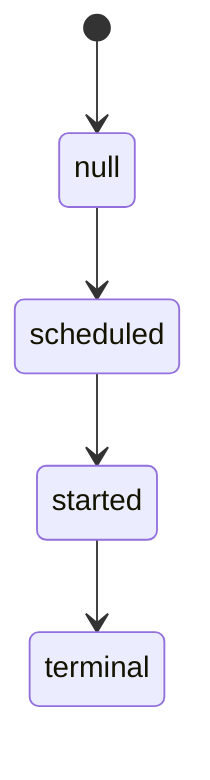

# Integrity and Semantic Validation Contract

- Version: semantic-validation-0.1.0
- Status: current

JSON Schema validates transport shape. It does not establish that hashes are
correct, references resolve, formulas were recomputed, signatures are valid,
or verdict fields agree. A scorecard or conformance statement is conforming
only after both schema validation and this semantic validation succeed.

## Canonical bytes and digests

Canonical JSON uses the
[RFC 8785 JSON Canonicalization Scheme](https://www.rfc-editor.org/rfc/rfc8785)
(JCS), encoded as
UTF-8. Unless a field says otherwise, a digest is
`sha256:<lowercase hexadecimal SHA-256 of canonical bytes>`. A document digest
omits its own digest and signature fields. Arrays retain declared order; sets
are first sorted by Unicode code-point order and deduplicated. Artifact bytes
are hashed exactly as stored, without newline or encoding normalization.

Every evidence reference resolves through the scorecard evidence manifest to
one immutable artifact containing media type, byte length, digest, producer
identity and role, trust domain, creation phase, timestamp, and a verifiable
attestation. A dangling reference, digest mismatch, wrong producer or phase,
or invalid attestation fails the affected path closed.

## Signed append-only ledger

The pre-run scheduled-cell manifest and initial ledger root are signed by the
runner identity and anchored outside the mutable run workspace. Ledger events
have a monotonic sequence, previous-event hash, event hash, and runner
signature. The terminal scorecard binds the initial root, terminal root, and
scheduled-set commitment. Validation recomputes the chain, verifies signatures,
and rejects missing, duplicate, reordered, or orphaned events and retry
lineages. For each `attemptId`, the reducer starts at `null`, requires
`null -> scheduled -> started -> terminal`, and requires every event's
`fromState` to equal the previously reduced `toState`. The terminal attempt
record must match that reduction, and every started attempt has exactly one
terminal record.

Rewriting a ledger and recomputing an unauthenticated hash is not
append-only evidence.

## Required scorecard checks

The versioned semantic validator MUST verify at least:

1. every baseline gate ID is present in the expected set; expected, added, and
   evaluated sets obey the sealed post-diff rules; every reported gate is
   backed by nonempty, valid evidence references;
2. governance-status sets obey the sealed trigger rules, and every terminal or
   `not_applicable` status has the evidence required by the Scorecard Contract;
3. trial acceptance is true if and only if validity is `valid`, the outcome is
   functional, every applicable hard gate passes, and every blocker is
   `not_applicable`, `resolved`, or policy-validly `waived`, and every material
   decision surface is `pass` or legitimately `not_applicable`;
4. an invalid trial has `infra_failure`, is not accepted, and does not enter a
   valid-only point estimate; agent-attributed interference remains a valid
   `unsafe_policy_violation` rather than infrastructure invalidity;
5. scheduled-cell, physical-attempt, retry-lineage, and mutually exclusive
   state counts equal the ledger; every nonterminal entry is reconciled; every
   resolved cell and terminal attempt `valid_success`/`valid_failure` state is
   recomputed from the trial result and the claim's sealed
   `successDefinition`; only the Scorecard Contract's executable
   `functional-outcome-v1` and `accepted-outcome-v1` predicates are valid;
6. `invalidRate = unresolvedCells / scheduledCells`; component binary-rate
   bounds stay within `[0,1]`, while comparative difference bounds stay within
   `[-1,1]`; interval endpoints are ordered; every pass@k/pass^k value is
   recomputed from consistent `validN`, `validSuccesses`, and `k`;
7. per-case contributions, weights, strata, and the run estimate reproduce the
   declared estimator and complete sealed case set;
8. `claim.status: supported` implies valid attempt integrity, a complete sealed
   plan, all required Case QA evidence with passing FP/FN validation whose
   intervals and threshold verdicts recompute, no coverage or telemetry gap material
   to the claim, and a recomputed decision rule that passes;
9. a blocked trial makes every containing composite blocked and unusable for
   ranking, tuning, capability, governance, or autonomy selection;
10. all identity-critical contract, suite, case, model, agent, environment,
    evaluator, grader, and formula versions resolve to authenticated digests.
11. both cost estimands are recomputed from every physical attempt record; the
    numerator, denominator predicate, success and attempt counts, reported and
    required cost counts, currency, price table, timestamp, and evidence agree.
    Missing cost with `fail_closed` yields `insufficient_evidence`; a
    `pre_registered_bound` policy requires the declared bound and reproduces it.
    `telemetry.status: complete` requires provider/schema, CLI/normalizer when
    applicable, raw native events, timing boundaries, token components, and
    tool-call definitions to be present and mutually consistent.
    A zero success count forces `insufficient_evidence`, null value, and the
    `zero_success_denominator` reason; the observed cost numerator remains.
12. decision-surface IDs match the case inventory exactly once; applicability
    rules and final-state proofs resolve through their versioned deterministic
    schemas and verifiers; assignments, triggers, check IDs, and evidence resolve; unknown
    applicability fails closed; final-state coverage proofs and claim restrictions are
    present where required; and no material `coverage_gap`, failure, or
    insufficient verdict supports a positive claim;
13. transcript evidence is `complete` for every valid trial, resolves to the raw runner-produced event
    stream, verifies its append-only root, proves pre-transform capture, and
    preserves context-management events. A compacted view, summary, cleared
    tool output, or agent-authored memory cannot satisfy this requirement;
14. interactive evidence is `complete` for every interactive valid trial and
    `not_applicable` only for a non-interactive valid trial; it binds the case
    protocol, has the same unique actor set, attributes every event and shared-state mutation, verifies initial and
    final state hashes, and has zero unattributed mutations when complete.

Any failed check produces `insufficient_evidence` for the affected positive,
comparative, or governance claim. A validator cannot repair or silently infer
missing evidence.

## Required Case QA checks

Case QA activation is itself subject to semantic validation before the case
loader permits `active`; validation is not deferred until a later scorecard.
The validator resolves the versioned calculation contract and raw adjudication
evidence for false-positive and false-negative estimates, recomputes sample
size, estimate, interval, endpoint order, threshold rule, and verdict, checks
expiry and coverage, and binds its result evidence into the activation record.
A mismatch, unknown method, expired validation, or non-`pass` verdict blocks
activation.
It also checks that decision-surface validation covers every case surface,
re-executes or recomputes the typed known-good, known-bad, and alternate-path
controls against their bound check and component digests, requires observed
verdicts to equal the sealed expected verdicts,
recomputes model-grader order and verbosity bias intervals and sealed-threshold
verdicts from their versioned calculation contracts, verifies typed identity-
blinding applicability, and recomputes unexpired model-to-human, inter-rater,
and self-consistency calibration. For interactive cases it enforces exactly one
evaluated agent, unique actor IDs, protocol references, and passing simulator
goal-persistence, disclosure, termination, refusal, anti-collusion, stability,
and variance evidence for every simulator actor. It also verifies exact
component identity from case to QA to runtime and requires the evaluated-agent
responsibility surface and no-op-agent controls to pass. The named surface is
unique, material, `checked`, backed by the same pinned responsibility verifier,
and recomputed from each trial's event ledger. Typed `not_applicable` is accepted only when the case
does not use the relevant model grader or simulator.

## Required conformance-statement checks

The validator verifies the issuer signature over the canonical statement,
every target-specific evidence bundle, the exact release tag and commit,
schema and component pins, operational (not template) governance artifacts for
decision/full targets, deviation-to-restriction coverage, and expiry. For a
decision target it also resolves the normative decision record, recomputes
every sealed condition and final decision, enforces
`effectiveAt < reviewAt <= expiresAt`, the policy's maximum lifetime and
risk-tier approval rules, role incompatibilities, and the non-waivable
registry. An approval must bind a post-decision assurance plan whose change
triggers cover every required trigger exactly once and bind its threshold,
claim effect, stop, scope, rollback, revalidation, and resume actions; whose production signals,
sampling, thresholds, owner, SLA, claim effects, and fail-closed missing-
evidence action agree with the operational policy and matrix. An
unsigned statement is an unauthenticated self-assertion and is not conforming.

## Governance-resolution ledger checks

The governance-resolution ledger has its own evidence manifest; post-run
evidence does not resolve through the immutable scorecard manifest. Validation
recomputes canonical event hashes, signatures, chain continuity, initial and
current roots, the external anchor, evidence digests and attestations, actor
authorization, role conflicts, and the effective blocker state over the
immutable scorecard. It rejects truncated, rewritten, reordered, forked, or
dangling history.

Every resolution binds a typed source event, its hash, governance-status ID,
risk tier, and registry-derived waivability. A claimed classification is
recomputed, not trusted. The `sourceEventHash` must resolve to an earlier
escalation payload in the same signed chain; an out-of-ledger source cannot be
resolved. `waive` is rejected for every baseline gate,
`heldOutLeakage`, `measurementBoundaryCompromise`,
`irreversibleCriticalOperation`, `productionCredentialsProhibited`, and every
unknown ID. `approvedConfigurationChanged` and `assuranceEvidenceMissing` are
also non-waivable. Interactive actor and assurance-evidence producer IDs are
cross-checked against incompatible governance roles.

Every expected assurance window has exactly one typed assurance-observation
event binding the assurance-plan hash, decision, scope, signal, window, sample,
estimate, uncertainty, threshold, verdict, producer, reviewer, and evidence.
The validator resolves the signal, sampling, calculation, and threshold
contracts and their pinned schemas and verifier identities; recomputes sample
count, estimate, interval ordering, uncertainty, missingness treatment,
threshold verdict, and effect; rejects malformed, zero, negative, or
calendar-ambiguous cadence and window durations so both decode to strictly
positive elapsed time; verifies
`anchorAt <= firstWindowStartsAt < firstWindowEndsAt`; and
reconciles every half-open UTC window against the anchor, cadence, window, and
first-window phase. A missing, late, duplicate,
or unauthenticated observation emits `assuranceEvidenceMissing`, and a breach
emits `productionConcordanceDegraded`. Escalation validation also checks that event, claim effect,
governance status, stop-action ID, scope-action ID, and row hash exactly match
the pinned operational matrix.

## Validator provenance

Results identify the semantic-validator ID, version, implementation digest,
validation timestamp, input digest, output digest, and evidence manifest. A
validator implementation is testable against positive and negative fixtures;
schema validity alone must never be presented as a conformance verdict.

## Changelog

- semantic-validation-0.1.0 — first public semantic-validation contract.
