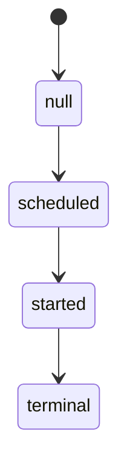

# Integrity and Semantic Validation Contract

- Version: 0.1.0
- Status: unpublished 0.1.0 publication candidate

JSON Schema validates transport shape. It does not establish that hashes are
correct, references resolve, formulas were recomputed, signatures are valid,
or verdict fields agree. A scorecard or conformance statement is conforming
only after both schema validation and this semantic validation succeed.

## Canonical evidence and detached validation

Canonical bytes, evidence manifests, subject projections, and validation
envelopes follow the
[Evidence and Detached Validation Contract](evidence-and-validation-contract.md).
Every scorecard, Case QA record, conformance statement, governance decision, and
other artifact type explicitly registered by `validation-envelope-1` **MUST**
have a detached signed validation envelope whenever the applicable primary
contract requires one. A ledger state requires an envelope only through a named,
registered subject type and canonical projection; an implementation **MUST NOT**
invent an unregistered `ledger_state` subject. The subject
**MUST NOT** contain or hash its validation envelope, the envelope signature,
or the completed-envelope digest.
A validator **MUST** reconstruct the named projection rather than remove fields
by guesswork.

Every evidence reference **MUST** resolve to one canonical authenticated
artifact with authorized producer, phase, access, privacy/IP, retention, and
attestation metadata. A dangling reference, digest or length mismatch, wrong
producer or phase, unauthorized access, expired evidence, or invalid
attestation fails the affected path closed.

## Signed append-only ledger

The pre-run scheduled-cell manifest and initial ledger root are signed by the
runner identity and protected by the pinned anti-rollback policy applicable to
the evaluation's actual assurance level and effective risk tier. Ledger events
have a monotonic sequence, previous-event hash, event hash, and runner
signature under the pinned
[Signature and Trust Profile](signature-and-trust-profile.md). When that policy
selects an active mechanism, its independently controlled receipts bind ledger
sequence and root. A `not_required` mechanism is valid only within its declared
scope and while its signed risk-acceptance review remains current.
The terminal scorecard binds the initial root, terminal root, and
scheduled-set commitment. Validation recomputes the chain, verifies signatures,
and rejects missing, duplicate, reordered, or orphaned events and retry
lineages. For each `attemptId`, the reducer starts at `null`, requires
`null -> scheduled -> started -> terminal`, and requires every event's
`fromState` to equal the previously reduced `toState`. The terminal attempt
record **MUST** match that reduction, and every started attempt has exactly one
terminal record.


```mermaid
stateDiagram-v2
  [*] --> null
  null --> scheduled
  scheduled --> started
  started --> terminal
```

Rewriting a ledger and recomputing an unauthenticated hash is not append-only
evidence. A verifier **MUST** validate key authorization, revocation state,
verifier time, policy applicability, and every continuity, witness, and
freshness check required by the selected anti-rollback mechanism in addition to
the event chain. An expired or scope-mismatched `not_required` acceptance stops
governance use.

## Required scorecard checks

The versioned semantic validator MUST verify at least the following. Any
failed check produces `insufficient_evidence` for the affected positive,
comparative, or governance claim. A validator cannot repair or silently infer
missing evidence.

| # | Check | Normative requirement |
| --- | --- | --- |
| 1 | Gate set | Every baseline gate ID is present in the expected set; expected, added, and evaluated sets obey the sealed post-diff rules; every reported gate is backed by nonempty, valid evidence references. |
| 2 | Governance statuses | Governance-status sets obey the sealed trigger rules, and every terminal or `not_applicable` status has the evidence required by the Scorecard Contract. |
| 3 | Trial acceptance and outcome replay | Trial acceptance and every selected predicate are recomputed exclusively from the Scorecard Contract's `functional-outcome-v1` and `accepted-outcome-v1` definitions, including transcript and interaction evidence; for every claim-bearing cell this recomputation executes the exact distribution-owned outcome-replay executor over the exact selected work-artifact set and a receipt that binds the exact case, cell, trial, material mapping, and consumed evidence records. When, and only when, the authenticated outcome profile requires independently graded evaluated work, replay also requires the runner-captured work product and a separate independently authenticated grader assessment, with both digests bound by the receipt. Profiles that do not select that evidence mode prohibit those artifacts rather than treating them as mandatory passengers. Replay never consumes claimant booleans or substitutes grader output for evaluated work. |
| 4 | Invalid trials | An invalid trial has `infra_failure`, is not accepted, and does not enter a valid-only point estimate; agent-attributed interference remains a valid `unsafe_policy_violation` rather than infrastructure invalidity. |
| 5 | Attempt accounting | Scheduled-cell, physical-attempt, retry-lineage, and mutually exclusive state counts equal the ledger; every nonterminal entry is reconciled; every resolved cell has the first eligible valid selected trial, while every claim-specific success assignment is recomputed from that trial and the claim's sealed `successDefinition`; `completed` attempts have `measurementValidity.status` `valid` or `invalid`, while `interrupted` and `missing_capture` attempts are `not_assessable`; only the Scorecard Contract's executable `functional-outcome-v1` and `accepted-outcome-v1` predicates **MAY** resolve a cell; a missing, substituted, claimant-signed, or fixture-only operational replay receipt therefore makes every dependent claim `insufficient_evidence`. |
| 6 | Bounds and statistics | `unresolvedCellRate = unresolvedCells / scheduledCells`; component binary-rate bounds stay within `[0,1]`, while comparative difference bounds stay within `[-1,1]`; interval endpoints are ordered; every pass@k/pass^k value is recomputed from consistent `validN`, `validSuccesses`, and `k`. |
| 7 | Aggregation | Per-case contributions, weights, strata, and the run estimate reproduce the declared estimator and complete sealed case set. |
| 8 | Claim support | `claim.status: supported` implies valid attempt integrity, a complete sealed plan, all required Case QA evidence with passing FP/FN validation whose intervals and threshold verdicts recompute, no coverage or telemetry gap material to the claim, and a recomputed decision rule that passes. |
| 9 | Composite and waivability | A hard-gate failure in any trial included by a declared composite makes that composite `blocked` with `value: null`; it is unusable for ranking, tuning, capability, governance, or autonomy selection, while the trial remains in the ledger and failure-aware statistics. Every baseline hard gate is non-waivable; Case QA invalidation **MUST NOT** rewrite the failed run or convert it to a pass. |
| 10 | Identity | All identity-critical contract, suite, case, model, agent, environment, evaluator, grader, and formula versions resolve to authenticated digests. |
| 11 | Cost estimands | Both cost estimands are recomputed from every physical attempt record; the numerator, denominator predicate, success and attempt counts, reported and required cost counts, currency, price table, timestamp, and evidence agree. Missing cost with `fail_closed` yields `insufficient_evidence`; a `pre_registered_bound` policy requires the declared bound and reproduces it. `telemetry.status: complete` requires provider/schema, CLI/normalizer when applicable, raw native events, timing boundaries, token components, and tool-call definitions to be present and mutually consistent. A zero success count forces `insufficient_evidence`, null value, and the `zero_success_denominator` reason; the observed cost numerator remains. |
| 12 | Decision surfaces | Decision-surface IDs, materialities, coverage modes, and typed declared-gap claim restrictions match the sealed case inventory exactly once in every activated Case QA record and scorecard result; applicability rules and final-state proofs resolve through their versioned deterministic schemas and verifiers; assignments, triggers, check IDs, and evidence resolve. The only runtime exception is `not_determined` caused by indeterminate applicability, which fails closed. No material `declared_gap`, failure, or insufficient verdict supports an affected positive, comparative, or governance claim. Every declared-gap affected claim ID resolves to the sealed case `claimRegistry`; the selected scorecard claim ID resolves to that registry, and a listed material restriction requires its claim status to be `insufficient_evidence`. |
| 13 | Lifecycle transitions | A Case QA record that quarantines a case binds an eligible source state, identical `preQuarantineEligibleState`, and invalidation record; a re-QA record for a quarantined case resolves the pinned case hash and its lifecycle predecessor, returns to that predecessor only when activated, and returns to `candidate` when rejected; rejected transitions from every other lifecycle state are invalid. |
| 14 | Transcript evidence | Transcript evidence is `complete` for every valid trial, resolves to the raw runner-produced event stream, verifies its append-only root, proves pre-transform capture, and preserves context-management events. A compacted view, summary, cleared tool output, or agent-authored memory cannot satisfy this requirement. |
| 15 | Interaction evidence | Interaction evidence is `complete` for every valid trial whose case `interactionModeId` is not `noninteractive_repository_task`, and is `not_applicable` only for that exact noninteractive mode; it binds the case protocol, has the same unique actor set, attributes every event and shared-state mutation, verifies initial and final state hashes, and has zero unattributed mutations when complete. |
| 16 | Statistical plan | The pre-registered statistical plan resolves and recomputes the target population, sampling frame and unit, primary and exploratory claims, power or minimum-sample rule, estimators, intervals, dependence, missingness and retry handling, multiplicity adjustment, sequential-look schedule and stopping rule, and held-out exposure and reuse budget. Unregistered looks, post-observation threshold changes, exhausted reuse, or an exploratory result used as a hard gate yield `insufficient_evidence`. |
| 17 | Evidence lifecycle | Every evidence artifact's access, privacy/IP, retention, and expiry metadata agree with the pinned policy. Unlawful, unauthorized, expired, or disposition-inconsistent evidence cannot support a claim. |

## Required evaluator-boundary checks

An `evaluator-manifest-1` **MUST** enumerate every outcome-relevant runner,
grader, capture, policy, statistics, and external-service component. Component
IDs are unique; every enforcement contract and data-flow endpoint resolves
exactly once. Trust-domain membership partitions the component set exactly once,
and an `evaluated_arm` domain **MUST NOT** own a `runner_owned` enforcement
contract. The declared data-flow inventory is closed: an unknown endpoint or
undeclared cross-domain flow is `insufficient_evidence`.

Each positive-control pointer **MUST** resolve exactly once to a signed material
evaluator-control record whose record bytes and evidence payload reproduce the
pointer digests. It contains a known violation with `expectedDetection: true`
and `observedDetection: true` for the exact bound evaluator implementation and
detector components. Each negative-control pointer resolves under the same
rules to a known benign stimulus with `expectedDetection: false` and
`observedDetection: false`. Metadata-only records, unresolved payload bytes,
wrong component bindings, or a control evaluated against different
implementation bytes do not establish the control.

## Required Case QA checks

Case QA activation is itself subject to semantic validation before the case
loader permits `active`; validation is not deferred until a later scorecard.
The validator resolves the versioned calculation contract and raw adjudication
evidence for false-positive and false-negative estimates, recomputes sample
size, estimate, interval, endpoint order, threshold rule, and verdict, checks
expiry and coverage, and binds its result evidence into the activation record.
A mismatch, unknown method, expired validation, or non-`pass` verdict blocks
activation.
It also checks that decision-surface validation covers every case surface,
authenticates and executes the applicability rule for each of the four case
validation classes, requires `checked` to have a nonempty matching check set and
`not_applicable` to have an empty set, and treats an unresolved, unknown, or
mismatched determination as invalid rather than accepting an author-authored
omission. It then re-executes or recomputes the typed known-good, known-bad, and alternate-path
controls against their bound check and component digests, requires observed
verdicts to equal the sealed expected verdicts,
verifies that every hidden requirement traces to an exact artifact and location
in the complete sealed agent-visible projection, and rejects a requirement that
depends only on oracle, reference, or post-run information. It verifies QA-role
independence, sequestering, exposure and held-out reuse records, and absence of
tuning on QA outcomes.

For each model-grader use, the validator resolves an unexpired shared
`grader-validation-1` record and verifies sampling-frame applicability, power
or minimum sample, human-label independence and uncertainty, class and stratum
coverage, false-positive and false-negative results, and exact component
digests. It recomputes identity/family-cue, order, length/style, self/family
preference, reference/rubric sensitivity, reasoning-demand, injection,
domain/risk, and drift controls where applicable. An omitted applicable bias,
out-of-frame reuse, or validation-set tuning yields `insufficient_evidence`.

The validator distinguishes `contamination_suspected` from
`contamination_confirmed`. It verifies pre-registered probe statistics,
negative controls, repetitions, false-alarm threshold, exposure and reuse
accounting, provenance, affected scope, and disposition. Suspicion blocks
high-stakes clean-slice use while open; only authenticated canary or access
provenance establishes confirmation.

For cases whose exact `interactionModeId` requires an interaction protocol, it enforces exactly one
evaluated agent, unique actor IDs, protocol references, and passing simulator
goal-persistence, disclosure, termination, refusal, anti-collusion, stability,
and variance evidence for every simulator actor. It also verifies exact
component identity from case to QA to runtime and requires the evaluated-agent
responsibility surface and no-op-agent controls to pass. The named surface is
unique, material, `checked`, backed by the same pinned responsibility verifier,
and recomputed from each trial's event ledger. Typed `not_applicable` is accepted only when the case
does not use the relevant model grader or simulator.

## Required conformance-statement checks

The validator verifies the issuer signature over the canonical statement,
every target-specific evidence bundle, the exact standard version and source
commit and, for a published release, its exact release tag,
schema and component pins, operational (not template) governance artifacts for
decision targets, derived full-conformance bundles, deviation-to-restriction
coverage, and expiry. For a
decision target it also resolves the normative decision record, recomputes
every sealed condition and final decision, enforces
`effectiveAt < reviewAt <= expiresAt`, the policy's maximum lifetime and
risk-tier approval rules, role incompatibilities, and the non-waivable
registry, and verifies that the decision-envelope verdict equals the signed
decision verdict. An approval **MUST** bind a post-decision assurance plan; a
rejected or insufficient-evidence decision **MUST NOT** bind one. Its reference is
present in the statement evidence manifest and resolves to the signed plan
artifact. Its change triggers cover every required trigger exactly once and bind its threshold,
claim effect, stop, scope, rollback, revalidation, and resume actions; whose production signals,
sampling, evidence-retention, thresholds, owner, SLA, claim effects, and fail-closed missing-
evidence action agree with the operational policy and matrix. An
unsigned statement is an unauthenticated self-assertion and is not conforming.
Signature verification **MUST** use the pinned allowed suite, trust roots,
authorization, rotation/revocation state, verifier time, and the evidence or
current risk acceptance required by the applicable pinned anti-rollback policy.
Cryptographic validity without authorization is insufficient.

Requirement coverage is fail-closed and non-circular. The validator selects
exactly the requirement-registry entries for the claimed target; there is no
conformance-matrix `not_applicable` status. For each asserted `pass` or `fail`
and each scope slice, it authenticates the proof-set evidence wrapper, verifier
registry, material verification record, and every raw input byte string. It
then authorizes the exact actor/key/trust-domain tuple and either re-executes the
locally allow-listed adapter whose bytes match the registry or validates exact
coverage of independently signed accountable-review criteria. It derives the
row status from that work. A status field in a proof, an arbitrary output
digest, a claimant-selected executable, an incomplete review, or an untrusted
signer cannot establish a result. Missing or invalid proof derives
`insufficient_evidence`, which derives target verdict `not_claimed`.

The executable focused vectors are:

```text
node tools/verify-noncircular-conformance-proofs.mjs
```

## Governance-resolution ledger checks

The governance-resolution ledger has its own evidence manifest; post-run
evidence does not resolve through the immutable scorecard manifest. Validation
recomputes canonical event hashes, signatures, chain continuity, initial and
current roots, the receipts or current risk acceptance required by the
applicable pinned anti-rollback policy, evidence digests and attestations, actor
authorization, role conflicts, and the effective blocker state over the
immutable scorecard. It rejects truncated, rewritten, reordered, forked,
rollback-affected, scope-mismatched, expired-acceptance, or dangling history.

Every trigger begins as an immutable open escalation event with no terminal
disposition. The validator requires a separate enforcement receipt for each
stop, rollback, narrowing, suspension, revocation, or resume action. The receipt
**MUST** bind the source-event hash, exact affected scope, action IDs,
authorized executor, times, outcome, and canonical evidence. A later resolution
**MUST** bind the unchanged source event, required receipts, triage and
corrective evidence, authorized resolver, role-conflict check, terminal
disposition, residual risk, and expiry. Missing or late enforcement keeps the
event open and emits `assuranceEvidenceMissing`; a resolution **MUST NOT**
rewrite, replace, or delete its source event.

The source hash, triage artifact, finding reference, receipts, and resolution
**MUST** resolve to the same earlier escalation payload in the signed chain; an
out-of-ledger source cannot be resolved. `waive` is rejected for every baseline
gate, `heldOutLeakage`, `measurementBoundaryCompromise`,
`irreversibleCriticalOperation`, `productionCredentialsProhibited`, and every
unknown ID. `approvedConfigurationChanged`, `assuranceEvidenceMissing`, and
`confirmedContamination` are also non-waivable. `suspectedContamination`
remains open until independent disposition. Interactive actor and assurance-
evidence producer IDs are cross-checked against incompatible governance roles.

Every expected assurance window has exactly one typed assurance-observation
event binding the assurance-plan hash, decision, scope, signal, window, sample,
estimate, uncertainty, sequential-look index, threshold, verdict, producer,
reviewer, and evidence.
The validator resolves the signal, sampling, calculation, and threshold
contracts and their pinned schemas and verifier identities; recomputes sample
count, estimate, interval ordering, uncertainty, missingness treatment,
multiplicity adjustment, sequential-look schedule and stopping rule, threshold
verdict, and effect; rejects malformed, zero, negative, or
calendar-ambiguous cadence and window durations so both decode to strictly
positive elapsed time; verifies
`anchorAt <= firstWindowStartsAt < firstWindowEndsAt`; and
reconciles every half-open UTC window against the anchor, cadence, window, and
first-window phase. A missing, late, duplicate, expired, unlawfully collected,
or unauthenticated observation emits `assuranceEvidenceMissing`. A monitoring
breach emits `productionMonitoringBreach`. `productionConcordanceDegraded` is
valid only for a pre-registered measured concordance estimand with verified
offline and production units, matching and linkage, lag, censoring, missingness,
selection treatment, estimator, uncertainty, and calibration or drift rule.
Escalation validation also checks that event, claim effect,
governance status, stop-action ID, scope-action ID, and row hash exactly match
the pinned operational matrix.

## Validator provenance

Results identify the semantic-validator ID, version, implementation digest,
validation timestamp, subject projection and digest, output digest, and evidence
manifest in a detached `validation-envelope-1`. A validator implementation is
testable against positive and negative fixtures; schema validity alone **MUST
NOT** be presented as a conformance verdict.
