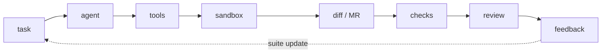
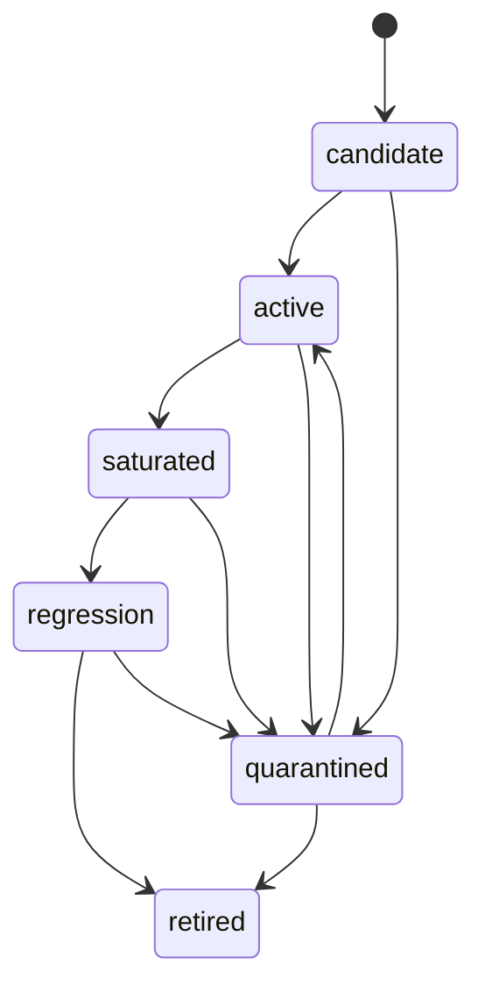
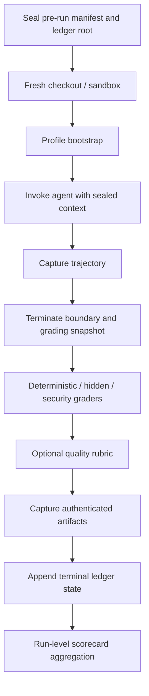

# Agent Evals Golden Standard

- Status: current
- Standard version: 3.0.1
- Purpose: the authoritative, implementation-independent standard for evaluating
  software-development lifecycle (SDLC) agents.

This document defines the ideal evaluation: the system under evaluation, the
invariants that must never be violated, and the requirements for case lifecycle,
execution, judgment, and governance. It is not a roadmap, a vendor comparison,
a task-specific plan, or a list of first-release compromises.

Each invariant is defined here once. Later sections define operational
consequences and reference invariants by identifier. Terms are defined in the
[Glossary](glossary.md). Rules for claiming adherence are defined by the
[Conformance Contract](conformance.md).

## System Under Evaluation

An evaluation must measure more than whether a model can write code. It must
measure the complete system:

An SDLC agent is evaluated as a composite system consisting of:

- one or more models;
- prompts, policies, and tool instructions;
- the harness: planning, retries, stopping rules, memory, and approvals;
- tools such as shell, Git, filesystem, browser, CI, issue tracker, and MCP;
- retrieval and available code context;
- the sandbox and environment constraints;
- outputs such as a diff, branch, merge request, review comment, test, or
  runbook;
- the feedback loop: review, CI, reverts, and incident feedback returned to the
  evaluation suite.

An evaluation must answer four questions:

1. To what extent did the system achieve the required outcome, and is that
   sufficient to consider the task solved?
2. How did the agent reach the outcome?
3. Did it violate any security, permission, or policy boundary?
4. What did the outcome cost in time, tokens, CI minutes, and review effort?

Public benchmarks and vendor claims can provide external context, but they are
not sufficient grounds for adopting an agent in a production SDLC. The primary
source of truth is a private golden set drawn from real company tasks, local
engineering rules, and production feedback.

## Invariants

These invariants are non-negotiable and non-compensable. Each is stated exactly
once; all later sections and child documents refer to them by identifier.

- **I1. Acceptance is non-compensable.** An accepted outcome requires
  `validity: valid`; every automated hard gate required by the baseline,
  risk-tier, profile, case, and sealed post-diff applicability rules to be
  backed and passed; and every expected blocking governance status to be
  `not_applicable`, `resolved`, or policy-validly `waived`. This predicate is
  **trial acceptance** only. Run claim eligibility additionally requires I5,
  I6, and the sealed statistical plan; governance approval is a later decision
  under the adopter-owned policy. Quality,
  efficiency, cost, and a composite score cannot compensate for an acceptance,
  security, or policy boundary violation.
- **I2. Lifecycle-wide oracle isolation.** The reference solution, hidden
  checks, grader fixtures, scoring internals, and all artifacts or state derived
  from them—including QA notes, previous hidden outputs, caches, retrieval
  indexes, and provider sessions—must remain inaccessible to the agent before
  and during a trial through the checkout, Git history, remotes, network, or
  tools, until the agent process and all delegated processes have terminated
  and their access has been revoked. Non-agent-visible held-out material must
  not be sent to external APIs or used in tuning, development loops, or
  training. Agent-visible held-out task input may be sent only to the declared
  agent provider under pre-approved data-owner and provider controls; doing so
  does not make oracle material exportable.
  Agent-attributed access is a hard-gate violation. Accidental exposure without
  established attribution yields `validity: invalid` and triggers the
  leakage-response process.
- **I3. No post-hoc adaptation or selection.** Before a run, a sealed pre-run
  manifest fixes suite and case membership, exclusions, quarantine criteria,
  risk tiers, ambiguity labels, allowed context, budgets, retry and stopping
  rules, the expected gate and governance-status sets, sealed post-diff
  applicability rules, success criteria, the scoring and statistical plan,
  thresholds, and decision rules. The only exception is an approved pre-run
  delta. A versioned migration applies only to future runs or an explicitly
  rebased comparison; it never rewrites the original scorecard or decision
  record.
- **I4. Reconstructible conditions and provenance.** Each trial starts from a
  clean environment with isolated filesystem, process, cache, retrieval,
  provider-session, and harness state. Any intentionally shared state is a
  declared treatment; affected observations must not be called independent,
  and the statistical plan must model or bound the dependence. The environment,
  tool policy, allowed context, agent configuration, and measurement stack are part
  of the evaluation identity. Machine-readable contracts are versioned, the
  complete manifest of identity-critical artifacts is content-hashed, and the
  deterministic baseline is periodically reconstructed in a clean environment.
- **I5. Attribution and complete attempt accounting.** Measurement-system
  failures must not be misclassified as agent failures. Every scheduled and
  started attempt—including invalid, interrupted, and missing-capture
  attempts—must appear in a runner-owned append-only ledger. Every replacement
  or retry links to the original attempt. Invalid attempts must not be silently
  removed from attempt accounting or eligibility decisions; any valid-only
  estimate is accompanied by the invalid rate and the pre-registered
  conservative bound defined in the Scorecard Contract. A
  pre-registered invalid-rate or differential-invalidity threshold breach yields
  `insufficient_evidence` for the affected claim.
- **I6. Claims are bounded by evidence.** Positive capability, comparative, and
  autonomy claims are limited to the pre-declared target population,
  represented strata, and multi-case statistical plan. Stochastic
  configurations require repeated trials with stated state-reset and
  dependence assumptions; independence may be claimed only when I4 permits it.
  An incomplete plan yields `insufficient_evidence`.
  One confirmed zero-tolerance security or policy incident can justify stopping
  or rejecting a run, but cannot support a broader positive or comparative
  claim.
- **I7. Enforced least privilege.** An evaluation must not use production
  credentials. Permissions, egress, and resource boundaries are declared in
  advance, limited to what the task requires, and independently audited. An
  unauthorized security or policy violation is a hard failure. The environment
  and risk contract defines the concrete sandbox, network, and logging controls;
  those controls cannot be replaced by a single post-hoc diagnostic.
- **I8. Optimization objectives are declared.** Diagnostic and cost telemetry
  is retained for every attempt. An efficiency metric becomes a tuning,
  ranking, or governance objective only through a pre-registered versioned
  rule with an explicit denominator and eligibility predicate.
  Conditional-on-success efficiency uses only valid functional outcomes;
  total-resource-per-success metrics retain the cost of every attempt and must
  not silently condition away failures or invalidity.
- **I9. Verifiable evidence; model-based graders are auxiliary.** Correctness,
  security, and production readiness require backed, auditable evidence.
  Model-based graders, including LLM-as-a-judge graders, and calibrated human
  annotation are auxiliary quality layers with published calibration. They
  cannot supply deterministic correctness or hard-gate evidence. A human
  governance gate is stored separately from annotation or score and must not be
  represented as an informal automated grader.
- **I10. Required decision paths fail closed.** If a required gate or detector
  cannot determine whether it applies or was triggered, the measurement path
  yields `validity: invalid`. If any required governance requirement—including
  human review, policy authorization, required evidence, or a decision-rule
  condition—is missing or indeterminate, it yields an `open` blocking
  governance status. Neither condition may become a silent pass or no-op.
  Failure of an optional auxiliary grader is recorded as unavailable and does
  not change deterministic correctness. If auxiliary evidence was
  pre-registered for a quality or statistical claim, its absence yields
  `insufficient_evidence` for that claim; it never becomes hard-gate evidence.
- **I11. Causal comparability of a living set.** A direct comparison requires
  the same suite version, case set, and pre-declared treatment difference; every
  other measurement-defining component in I4 remains fixed. A frozen common
  slice supports comparison only within that slice. A cross-version rebased
  comparison requires an equivalence study and documented migration with a
  changelog entry. Matching suite versions is necessary but not sufficient.
- **I12. Only validated measurement enters claims.** Every active case has a
  current machine-verifiable Case QA record. Its checks require only behavior
  inferable from the task description, distinguish known-good from known-bad
  controls, and accept a correct non-reference solution. Invalidating the QA
  record atomically moves the case to `quarantined` until re-QA completes.
  Grader false-positive and false-negative rates are estimated under a
  versioned validation protocol with uncertainty and thresholds. Suite health
  is evaluated regularly; a threshold breach blocks affected claims.
- **I13. Trusted measurement boundary.** Everything produced or influenced by
  the agent—including diffs, code, hooks, logs, result files, comments, and
  commit messages—is untrusted input. Graders, validation commands and
  toolchains, the base manifest, result channels, and artifact capture belong
  to a runner-owned trust domain. Evidence has typed, authenticated provenance
  and is processed with bounded parsing, contextual escaping, and
  injection-resistant controls. The baseline gate registry includes a
  runner-backed measurement-boundary gate with positive controls for
  instruction injection and mutation during grading.

## Reading Paths

The system under evaluation and I1–I13 apply to every path. The remaining
sections need not be read linearly:

- case authors: [Case Lifecycle Requirements](#case-lifecycle-requirements),
  then the [Case QA Playbook](case-qa-playbook.md);
- run reviewers: [Judgment Requirements](#judgment-requirements), then the
  [Scorecard Contract](scorecard-contract.md);
- governance decision-makers:
  [Governance and Human-Role Requirements](#governance-and-human-role-requirements),
  then the [Governance Policy](governance-policy.md);
- platform engineers: [Execution Requirements](#execution-requirements), then
  the contracts and profile documentation listed in the
  [documentation map](../README.md).

## Case Lifecycle Requirements

### Lifecycle States

**Purpose.** Lifecycle state separates capability measurement from activation,
regression monitoring, defective cases, and historical archives.

**Requirements.** Each case has exactly one lifecycle state:

- `candidate` — prepared but not activated; excluded from reporting;
- `active` — passed Case QA and participates in capability sets;
- `saturated` — solved consistently by every tracked configuration, with no
  remaining capability headroom;
- `regression` — a mutually exclusive lifecycle state for monitoring with a
  pre-registered reliability threshold and breach response;
- `quarantined` — excluded from agent-failure aggregation until repaired,
  retired, or migrated under a documented process;
- `retired` — removed while preserving historical records.
- The saturation policy defines the criterion in advance using a reliability
  estimand, minimum evidence requirement, and uncertainty threshold—for
  example, a lower confidence bound on pass^k above a stated threshold for
  every tracked configuration over a fixed observation window.
- Saturated cases move to regression monitoring, while the capability set is
  replenished to preserve headroom. A fully saturated set no longer measures
  progress.

**Related rules.** I3 and I11 define pre-registration and comparability. The
[Case QA Playbook](case-qa-playbook.md) defines activation and quarantine.

### Sourcing and Composition

**Purpose.** The golden set must represent real engineering work, preserve
headroom, and keep clean measurement separate from contamination risk.

**Requirements.**

- Build the set from real company work, covering bug fixes, small features,
  behavior-preserving refactors, dependency upgrades, flaky build and CI fixes,
  security and privacy fixes, test generation, and adversarial and policy
  cases—not only easy bug fixes.
- Prefer “case = commit”: `base` identifies the snapshot given to the agent,
  and `reference`, when available, demonstrates solvability. Synthetic and
  adversarial cases require an explicit rationale, validation rules, owner,
  risk tier, and pinned repository or fixture snapshot, with agent context
  separated from the oracle.
- Define composition strata by task class, risk tier, component, runtime class,
  difficulty, and ambiguity status, with weights or stratified reporting. Track
  the difficulty distribution and headroom.
- Redact real-task artifacts for PII, customer or internal-sensitive data, and
  secret-like values. Define their access tier, retention period, and a
  prohibition on external export without data-owner approval.
- Record contamination metadata: source visibility, public dates, previous
  evaluation exposure, potential training-data or model-memory leakage, and
  whether an agent previously solved the task in the workspace.
- Embed runner-only canaries in oracle artifacts and record their hashes and
  access class. They never enter the agent-visible projection. Agent-visible
  markers, when used to trace redistribution, are a separate class and are not
  evidence of oracle access. Run a memorization probe before using a
  high-stakes held-out case for governance.
- Do not combine cases with material contamination risk into clean held-out
  reporting without an explicit label.
- On suspected leakage, quarantine affected cases, revisit historical
  comparisons, and rotate the set. A pre-approved data-owner decision may
  authorize export only for material that is not held out. The sole held-out
  exception is declared processing of the agent-visible projection by the
  evaluated provider under I2 controls, with no oracle content, retention,
  training, or unrelated reuse. Removing held-out status requires a versioned
  suite change and a separate reporting slice.

**Related rules.** I2 defines oracle isolation and confidentiality; I11 defines
comparability. See the [Security Case Backlog](security-case-backlog.md) and the
[contamination probes](case-qa-playbook.md#contamination-probes).

### Authoring

**Purpose.** A case contract must be reproducible, test the stated outcome, and
allow more than one correct solution.

**Requirements.**

- The runner-owned case contract contains a stable ID, source type and
  source-artifact link
  when available, repository and pinned commit snapshot, task description,
  profile, setup and validation executor references, hidden acceptance checks or a link to
  them, scoring rules, risk tier, owner, review date, canary marker, and
  contamination metadata. A separately defined agent-visible projection
  excludes reference material, hidden-check content or links, scoring
  internals, and oracle-derived metadata.
- Evaluate outcome and risk, not similarity to the reference diff. The
  reference solution demonstrates solvability and calibrates checks; it is not
  the only acceptable implementation. Acceptance checks enforce outcome
  invariants promised by the task description rather than details of the
  reference implementation (I12).
- Remove PII, secrets, and irrelevant noise from the task description while
  preserving real-world ambiguity unless the case is labeled `clear-cut`.
  Record material rewording in the case notes.
- Keep ticket or merge-request identifiers and solution commit messages out of
  agent-visible context because they can reveal the canonical fix (I2).
- Assign `clear-cut` or `ambiguous` before execution using two independent
  annotators; do not change it retroactively (I3). Do not mix ambiguous and
  clear-cut cases in an unstratified solve-rate calculation.
- An `ambiguous` case without a sealed interactive requester protocol must
  declare the defensible resolution set and accept every member through
  deterministic checks. If success depends on information only a requester can
  supply, keep the case out of capability claims until the runner implements
  that protocol. Asking a question alone is not task completion and must not be
  relabeled as `solved` or `correct_refusal`.
- For behavior-preserving refactor cases, behavioral guard checks pass on both
  `base` and `reference`. The discriminating acceptance signal must be a formal
  refactoring requirement—an architectural rule, removal of a prohibited
  pattern, dependency direction, a complexity or duplication threshold, or
  another objective assertion that distinguishes `base` from a successful
  solution.
- Tag every case by at least task class, repository or component, language and
  stack, risk tier, expected runtime class, difficulty or expected solve-rate
  band, owner team, and ambiguity status.
- Every case has an owner accountable for reproducibility, review dates,
  quarantine of flaky cases, and check updates when production feedback reveals
  a false positive or false negative.

**Related rules.** I2, I3, and I12 define oracle, pre-registration, and check
quality requirements. The normative machine-readable shape is
[`schemas/case.schema.json`](../schemas/case.schema.json); profiles may extend
but not weaken it under the [Conformance Contract](conformance.md).

### Activation: Case QA

**Purpose.** Only cases with demonstrated solvability, discriminating power,
and stable checks enter the active suite.

**Requirements.** Activation requires a staged pipeline and at least:

- the reference solution or known-good baseline passes the runner-owned
  control-run protocol defined by the Case QA Playbook; a control run prepares
  the known-good workspace directly and executes the same environment,
  teardown, grading, and artifact-capture boundary without pretending that a
  static solution is an agent attempt;
- the base or a known-bad solution fails the expected discriminating check when
  a change is required;
- policy and security gates have positive controls for prohibited behavior;
- no trivial strategy—empty diff, revert, hard-coded expected output, or
  weakened checks—achieves a successful outcome;
- at least one correct non-reference solution passes hidden checks (I12);
- every case defect is assigned a severity, and severity 2 or higher blocks
  activation;
- activation is recorded in a Case QA record.

**Related rules.** I12 is normative. The
[Case QA Playbook](case-qa-playbook.md) defines stages, defect taxonomy, and
record format.

### Operation and Maintenance

**Purpose.** Production feedback and measurement-system degradation must update
the suite explicitly instead of accumulating as hidden noise.

**Requirements.** The maintenance loop includes:

- production revert -> new evaluation case or stronger existing case;
- escaped defect -> hidden regression case;
- security incident -> adversarial or security case;
- repeated review rejection -> rubric or profile-grader update;
- flaky infrastructure failure -> quarantine until stable;
- obsolete dependency or setup -> case review;
- recurring false positive or false negative -> scoring-rule and Case QA
  review;
- suspected held-out-set leakage -> case rotation and update.
- Enforce the I12 quarantine transition in the same atomic operation that
  invalidates the QA record; use the Case QA Playbook for reactivation.
- If the reference or baseline unexpectedly fails because of infrastructure,
  dependency drift, or an obsolete oracle, quarantine the case automatically
  and do not count the event as agent failure.
- Define review SLAs by risk tier. Stale or repeatedly flaky cases must not
  remain silently active.
- Changes to checks, environment, or graders; FP/FN signals; contamination; and
  saturation review invalidate the QA record and trigger the applicable re-QA
  stages.

**Related rules.** I5 defines infrastructure attribution. See the
[re-QA triggers](case-qa-playbook.md#re-qa-triggers).

### Suite Modes and Versioning

**Purpose.** Separate sets support fast feedback, development, governance, and
longitudinal comparison without mixing claims.

**Requirements.** The golden set has versioned modes:

- smoke set — a small, fast subset for CI checks of harness, prompt, and
  infrastructure changes; not evidence for capability claims;
- development/evaluation set — regular agent and harness iteration;
- held-out/release set — governance decisions and expansion of autonomy;
- frozen comparison set or slices — longitudinal trends.
- A living set expands coverage. Historical comparison remains limited to a
  frozen common slice or an I11-compliant rebased comparison.

**Related rules.** I11 defines comparability; I2 defines held-out
confidentiality.

## Execution Requirements

### Core, Profiles, and Adapters

**Purpose.** Generic evaluation mechanics must remain independent of both the
application domain and a particular agent harness.

**Requirements.**

- A conforming evaluator core owns case loading and schema validation, clean checkout and trial
  isolation, adapter invocation, artifact capture, the grader registry,
  scoring, hard gates, aggregation, pass^k, and a stable output format.
- A profile provides stack-specific bootstrap, domain graders, hidden
  acceptance checks, a domain rubric, local rules, and command-to-metric
  mappings.
- An adapter isolates harness-specific invocation. Core and graders do not
  depend on the agent or invocation method, and adding an adapter does not
  require changes to the case model, profiles, or scoring.

**Related rules.** The core/profile boundary is mandatory. Concrete interfaces
belong in implementation and profile documentation.

### Versioned Contracts and Immutability

**Purpose.** Runs must be reproducible, and measurement-stack changes must be
visible in provenance and comparability decisions.

**Requirements.**

- Case, scorecard, profile, adapter, grader, scoring-formula, and environment
  contracts carry explicit version and provenance information and hashes for
  identity-critical artifacts (I4). Changing a grader or scoring formula
  without a new version makes historical scorecards incomparable. The
  scorecard also records the version of this standard and the applicable
  governance policy. Cross-version comparison requires the equivalence study
  and documented migration in I11. Concrete field names belong in schema and
  profile documentation.
- Agent-visible case and profile inputs are immutable during a trial: they are
  outside the writable root, mounted read-only, or protected by equivalent
  enforcement. Hidden, oracle, grader, and scoring artifacts must remain
  outside every agent-readable path, mount, and tool—not merely read-only (I2).
  A pre/post hash mismatch in those artifacts yields
  `unsafe_policy_violation` when attributable to the agent and
  `validity: invalid` otherwise.
- Before grading, terminate the agent execution boundary and revoke all local
  and remote delegated processes, sessions, and callbacks. Endpoint snapshots
  alone do not prove quiescence; the runner records teardown/revocation
  evidence and grades an immutable captured snapshot through an authenticated
  result channel. Mount the captured workspace read-only for graders,
  audit agent-controlled interpreter and test injection points such as
  `conftest.py`, `sitecustomize.py`, `.pth`, and Git hooks, and compare trusted
  workspace manifests before and after grading. Indeterminate concurrent
  mutation invalidates the trial; attributed manipulation fails the I13 gate.

**Related rules.** I4 and I2 define reproducibility and oracle isolation. See
the [Scorecard Contract provenance fields](scorecard-contract.md#provenance-fields).

### Environment Contract

**Purpose.** The environment is a controlled part of the measurement, not an
implicit external precondition.

**Requirements.**

- The environment contract records toolchain and runtime versions, dependency
  resolution, external-service and network policy, cache policy, and resource
  limits.
- The sandbox is ephemeral and constrained: network disabled by default with
  only the necessary allowlist; no uncontrolled container, orchestrator, or
  equivalent execution control plane
  socket; least-privilege filesystem and tools; CPU, memory, disk, and wall-clock
  limits; and an audit log of tool calls and approvals.

**Related rules.** I4 and I7 define reproducibility and enforced least
privilege. Concrete stack-specific fields belong in the case model or profile.

### Run Protocol

**Purpose.** A consistent trial protocol separates agent behavior from
incidental differences in checkout, grading, and artifact capture.

**Requirements.** Before the first trial, the runner seals the I3 pre-run
manifest and externally anchors the scheduled-cell commitment and initial
runner-signed ledger root. Each scheduled cell receives a durable ledger entry
before execution. Each physical attempt follows this ordered protocol;
explicitly conditional steps run only when their sealed rule applies:

1. Create a fresh checkout or sandbox at the base snapshot using the complete
   agent-visible projection required by I2.
2. Run profile bootstrap.
3. Give the agent only the task description and permitted context sealed in
   that projection.
4. Durably append the `started` transition, then invoke the adapter with the
   fixed budget and tool policy.
5. Capture the trajectory: commands, tool calls, approvals, stdout and stderr,
   transcript, files read and written, and diff.
6. Terminate the agent boundary; revoke every local and remote delegate,
   session, and callback; verify the teardown contract; and capture an immutable
   grading snapshot. If this cannot be established, do not expose oracle
   material and mark the attempt invalid.
7. Run deterministic graders.
8. Run hidden and regression graders.
9. Run security and policy graders.
10. When declared, run the optional quality rubric.
11. Capture per-attempt artifacts through the authenticated result channel.
12. Append the terminal attempt state, validity, retry parent, and artifact
    hashes to the ledger and sign the new root. On runner recovery, reconcile
    every nonterminal entry as interrupted or continue it under the sealed
    retry rule; never delete it.

After all scheduled trials reach a ledger state, aggregate the entire ledger
into the run-level scorecard. Aggregation is a run step, not part of a trial.

- An externally evidenced failure of checkout, bootstrap, registry, sandbox,
  grader, hidden-test harness, artifact capture, infrastructure quota, or an
  external dependency is an infrastructure failure, not an agent failure.
- Agent-attributed interference with graders, logs, or artifact capture yields
  `unsafe_policy_violation`. When attribution cannot be established, use
  `validity: invalid`; the primary outcome must not be interpreted as agent
  success or failure. Under Scorecard Contract schema v3, its required primary
  outcome is the `infra_failure` umbrella while validity remains authoritative.
- An invalid or missing-capture attempt remains present after a retry. The
  run-level scorecard records scheduled, started, completed, invalid, and
  replacement counts, invalid rate, and retry lineage (I5).
- Store the primary outcome separately from non-exclusive failure causes. Do not
  lose infrastructure causes during aggregation even when an agent-attributed
  outcome has higher priority.

**Related rules.** I2, I5, and I13 define oracle isolation, attribution, and
untrusted-output handling. This protocol remains normative until superseded by
a versioned run-protocol contract.

## Judgment Requirements

### Automated Hard Gates and Governance Blockers

**Purpose.** Hard gates and governance blockers must stop acceptance before
quality metrics or a composite score can obscure a violation.

**Requirements.**

- A gate is deterministic and auditable: stable evidence produces a stable
  decision. A flaky check cannot become a gate without a stability proof or
  quarantine.
- A gate is backed: it has an executable or formally specified evidence source,
  and the scorecard links to the supporting artifact. A declared but unbacked
  gate makes the run configuration invalid; it does not pass.
- Required decision paths fail closed (I10).
- An `open` or unresolved blocking governance status, or an unauthorized waiver,
  prevents acceptance but does not replace an automated grader (I9). Closure
  follows the pinned governance policy. Display hard-gate failures and blocking
  governance statuses prominently in the scorecard.

**Related rules.** I1, I9, and I10 define non-compensation and fail-closed
semantics. The versioned [Gate Registry](scorecard-contract.md#gate-registry)
defines mandatory IDs, conditions, and failure mappings. The
[Case QA Playbook](case-qa-playbook.md) defines stability proofs.

### Outcomes and Scorecard

**Purpose.** A scorecard must classify each trial unambiguously without losing
diagnostic causes, governance blockers, or provenance.

**Requirements.**

- Each trial has exactly one primary outcome from a versioned taxonomy. Change
  its semantics, fixed priority order, or assignment rules only in a new
  contract version.
- Store non-exclusive failure causes beside the primary outcome, including the
  distinction between `budget_exhausted` and infrastructure timeout, and store
  orthogonal governance statuses separately.
- Include gate and governance statuses, primary outcome, failure causes,
  per-metric and per-trial results, applicable pass@k and pass^k/reliability@k
  with confidence intervals, cost and time, provenance, and links to artifacts,
  Case QA records, and the governance decision record.
- A composite score is optional and supports only diagnostics after hard
  gates. A hard-gate failure marks the trial composite `blocked`; any composite
  aggregate containing it is non-rankable for capability, tuning, governance,
  or autonomy decisions. This does not invalidate failure-aware pass rates,
  pass@k/pass^k, uncertainty, or other non-compensating capability statistics,
  which retain the failed trial. A separately named diagnostic visualization
  may show a floor value but carries no selection or acceptance meaning.

**Related rules.** I1 and I4 define non-compensation and reproducibility. The
versioned [Scorecard Contract](scorecard-contract.md) defines categories,
fields, formulas, and metric families.

### Statistics

**Purpose.** Statistical claims must reflect variation across cases and
stochastic trials rather than a single lucky success.

**Requirements.**

- Evaluate stochastic agents with repeated trials. One trial provides no
  reliability estimate, variance estimate, or basis for comparison.
- Report pass@k and pass^k/reliability@k separately when applicable.
- Aggregate and estimate uncertainty by case. With repeated trials, cluster
  standard errors by case.
- Compare configurations using paired case-level differences. If the complete
  case sets differ, the claim is restricted to the pre-declared shared frozen
  slice and is not a direct full-suite comparison (I11).
- A comparative claim requires a pre-registered statistical plan specifying
  the unit of analysis, confidence-interval method, comparison test, minimum
  sample or power rule, handling of ambiguous, quarantined, and invalid
  attempts, retry policy, state reset, randomization or blocking, independence
  assumptions, and `insufficient_evidence` when the plan is not met.
- Name the target population, represented strata, weighting, and coverage gaps.
  Unsupported strata do not inherit the aggregate claim.

**Related rules.** I3 and I6 define pre-registration and evidence sufficiency.
See the [Scorecard Contract statistics fields](scorecard-contract.md#statistics-fields).

## Governance and Human-Role Requirements

### Risk Tiers

**Purpose.** Risk tiers connect potential harm to required constraints and
evidence before a trial begins.

**Requirements.**

- assign every case a tier before the trial;
- use the highest applicable tier;
- allow a downgrade only when the applicable non-stub policy makes tiers
  operationally different and permits a documented pre-run exception;
- use the tier to determine required hard gates, manual and security review,
  network and tool permissions, artifact retention, and minimum evidence.

**Related rules.** I3 prohibits post-hoc adaptation. Tier definitions,
versioning, and migration rules belong to the
[Governance Policy](governance-policy.md#risk-tier-taxonomy).

### Human Roles

**Purpose.** People establish ground truth, calibration, and accountability
without replacing deterministic measurement with informal opinion.

**Requirements.**

- People select representative tasks, verify solvability, approve risk tiers
  and prohibited actions, validate hidden checks, calibrate rubrics, audit false
  positives and false negatives, and make high-risk governance decisions.
- Model-grader and rubric calibration reports model-to-human and inter-rater agreement,
  self-consistency, statistic, threshold, sample size, adjudication rule, and
  validation date.
- Calibrated human annotation does not assign acceptance, primary outcome, or
  composite value and does not replace deterministic checks. Any
  decision-bearing human requirement uses the separate governance-status field.

**Related rules.** I9 and I3 define the role of deterministic checks and the
prohibition on post-hoc changes.

### Transcript Review Loop

**Purpose.** Transcript review identifies unfair failures, hidden exploits, and
new failure modes that aggregate metrics cannot reveal.

**Requirements.**

- For every governance run, review a sample of transcripts meeting the minimum
  quota in the adopter-owned policy instance conforming to the
  [Governance Policy template](governance-policy.md). Prioritize
  `public_pass_hidden_fail`, `unsafe_policy_violation`, `partial`, and cost or
  time outliers.
- Ask two questions: are failures genuine rather than case defects, and are
  successes genuine rather than exploits or contamination?
- Maintain a versioned failure-mode taxonomy. Convert findings into case defects
  under the [Case QA Playbook](case-qa-playbook.md), new cases, or grader
  changes.
- Regularly audit grader false positives and false negatives and include the
  results in suite-health reporting.

**Related rules.** The [Governance Policy template](governance-policy.md)
requires the adopter policy instance to define the minimum governance quota;
the [Case QA Playbook](case-qa-playbook.md) governs
defects and re-QA.

### Governance Decisions and Escalation

**Purpose.** Autonomy, release, and risk-acceptance decisions must be
pre-registered, auditable, and reversible when a high-risk signal appears.

**Requirements.**

- Before a held-out or release run, record an immutable decision-plan ID, hash,
  and timestamp and a risk-tier decision rule specifying the evidence level,
  pass^k or pass@k and confidence requirements, zero-tolerance gates, review and
  cost burden, governance statuses, and explicit approve, reject, and
  insufficient-evidence conditions.
- The decision record links the policy, plan, and scorecard and records run IDs;
  the exact approved configuration, task, risk, repository, environment, tool,
  target-population, and represented-strata scope, including exclusions and
  coverage gaps; effective and expiry dates; decision and rationale; residual
  risks and mitigations; approvers; accountable risk owner; false-positive and
  false-negative owners; overrides; and next review date.
- Preserve the original finding for every triggered blocking governance status
  and track it as `open`, `resolved`, or `waived`; record untriggered expected
  statuses as `not_applicable`. A terminal state requires a
  disposition, authorized resolver, timestamp, and evidence. A waiver is valid
  only when the adopter policy instance explicitly permits it for the status
  and risk tier. Record the policy reference and named authority for any waiver.
- The escalation and stop matrix covers hard-gate regression, untriaged high or
  critical security findings, held-out leakage, escaped high or critical
  defects, repeated review rejection, stale suites, FP/FN threshold breaches,
  and suite-health degradation. Each event has an owner, SLA, triage artifact,
  rollback or scope-reduction action, and resume condition.
- No metric, including a composite score, is a final decision by itself. An
  autonomy decision considers outcome, security, cost, and review burden.

**Related rules.** I3 defines pre-registration. The
[Governance Policy template](governance-policy.md) defines the required policy
shape; the adopter-owned policy instance defines thresholds and decision rules;
the
[Governance Decision Record Template](../templates/governance-decision-record.md)
defines record shape; and the
[Escalation and Stop Matrix](escalation-stop-matrix.md) defines operational
response.

## Suite-Health Requirements

**Purpose.** Evaluation suites can degrade silently as contamination,
saturation, flaky checks, and unfair tests accumulate. Suite health therefore
requires monitoring as regular as agent-quality measurement.

**Requirements.** The suite-health report includes:

- grader false-positive and false-negative rates from audit samples and the
  proportion of failures reclassified as case defects during transcript review;
- flake rate, proportion of quarantined cases, and time in quarantine before
  repair or retirement;
- saturation curve: solve-rate distribution by difficulty, capability-set
  headroom, and cases moved into regression monitoring;
- activation completeness: proportion of active cases with a valid Case QA
  record;
- contamination: canary detections, memorization-probe results, and proportion
  of cases with contamination flags in clean reporting;
- when a model-based grader is enabled, model-grader health: agreement drift
  against the calibration set, where lower is better, and prompt-injection
  detection rate on positive controls, where higher is better (I13); otherwise
  the report records `not_applicable` and the reason;
- degradation thresholds and responses. A threshold breach is a blocking event
  for governance use of the suite, not merely an informational finding.

**Related rules.** I12 defines measurement-product quality and I13 defines
  untrusted model-grader input. The
[Escalation and Stop Matrix](escalation-stop-matrix.md) defines thresholds and
responses.

## Deliberate Exclusions

Some public-benchmark practices are intentionally inappropriate for a private
golden set. I2 excludes open publication and external submission of
non-agent-visible held-out material. Declared provider processing of the
agent-visible projection under I2 is not such a submission. The
real-company-work sourcing requirement excludes
crowdsourced tasks from the primary golden set. Public leaderboards are omitted
because they incentivize repeated adaptation to the held-out set. External
methodologies become local requirements only when they change a local rule.
The sources that informed this release are listed in
[Informative References](references.md).

## Changelog

- 3.0.1 (2026-07-22) — dedicated the repository contents to the public domain
  under CC0 1.0 Universal. No evaluation, conformance, or component-contract
  requirements changed.
- Documentation (2026-07-22) — added informative Mermaid diagrams for the
  system under evaluation, case lifecycle states, and run protocol. This did
  not independently change normative requirements or the standard version.
- 3.0.0 (2026-07-21) — created the first standalone public release; added a
  conformance contract; separated normative requirements from implementation
  status; and adopted technology-neutral execution and control-plane gate IDs.
  This is a major release because stable identifiers changed.
- 2.1.0 (2026-07-21) — reconciled gate pre-registration with sealed post-diff
  expansion, made governance applicability explicit, defined lifecycle-wide
  oracle isolation through process termination, required an I13 baseline gate,
  reconciled dependence and comparability rules, repaired lifecycle and run
  protocol semantics, required deterministic coverage of ambiguous-case
  resolutions, and removed duplicated operational restatements.
- 2.0.0 (2026-07-21) — retained stable IDs I1–I13 while clarifying their
  boundaries. Added sealed pre-run selection, complete attempt accounting,
  evidence-bounded claims, and a runner-owned measurement boundary. Moved
  confidentiality into I2; made I8 an enforceable optimization-objective rule;
  removed run-order semantics from I9; limited I10 to required decision paths;
  required causal comparability in I11; and required task and check validity
  plus atomic quarantine in I12. Resolved the read-only oracle-mount
  contradiction.
- 1.0.0 (2026-07-16) — established the first versioned baseline; moved
  definitions into the shared glossary; added role-based reading paths and a
  common requirements template; delegated the gate registry to the Scorecard
  Contract and the risk-tier taxonomy to the Governance Policy; and clarified
  normative provenance and attribution for interference with the measurement
  system.
