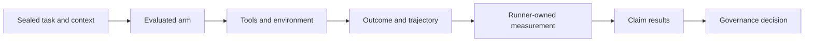
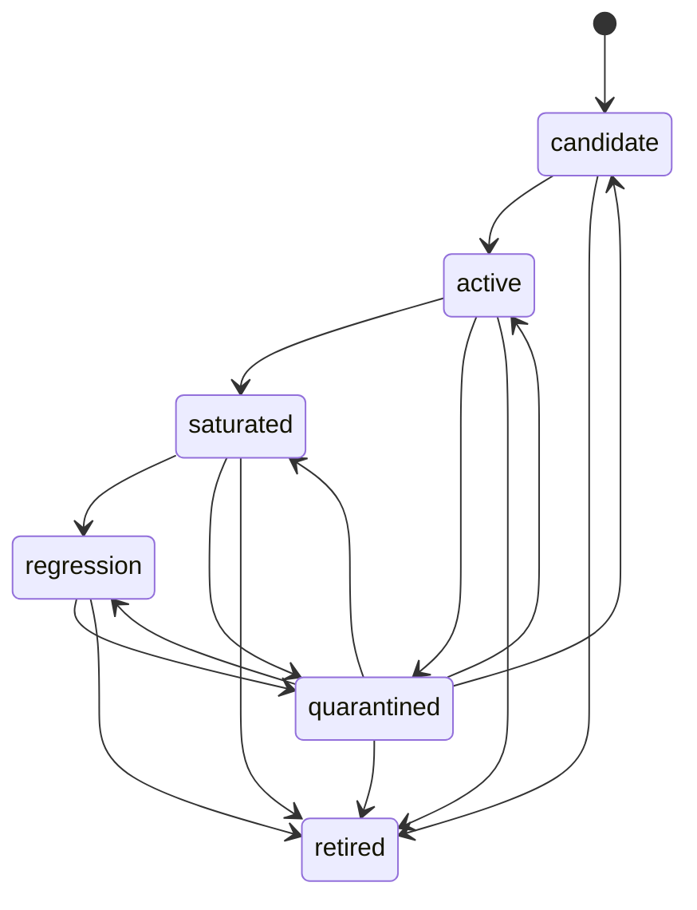

# Git-backed Repository SDLC Agent Evals Standard

- Status: unpublished 0.1.0 publication candidate
- Version: 0.1.0
- Purpose: implementation-independent requirements for evaluating agents that
  work with Git-backed code repositories across the software-development
  lifecycle (SDLC).

This standard specifies trustworthy evaluation evidence, not a runner, vendor
ranking, benchmark, or universal release threshold. Stable requirement IDs and
their evidence traceability are defined in the
[Requirements Registry](requirements.md). Terms are defined in the
[Glossary](glossary.md), concrete scorecard semantics in the
[Scorecard Contract](scorecard-contract.md), and adherence rules in
[Conformance](conformance.md).

## System Under Evaluation

`SCOPE-001` — An evaluation **MUST** identify the complete system under
evaluation, including every model, prompt, policy, harness, tool, permission,
budget, retrieval source, memory mechanism, approval path, environment,
external service, and stopping rule that can affect behavior. A model name alone
is not a system identity.

The measurement boundary is separate from the evaluated system:

```mermaid
flowchart LR
  task["Sealed task and context"] --> arm["Evaluated arm"]
  arm --> tools["Tools and environment"]
  tools --> result["Outcome and trajectory"]
  result --> measure["Runner-owned measurement"]
  measure --> claims["Claim results"]
  claims --> decision["Governance decision"]
```

An evaluation answers five distinct questions:

1. What construct and target population does the experiment represent?
2. What outcome did each arm produce, and what evidence supports that outcome?
3. Which consequential decisions and trajectories produced it?
4. Which safety, permission, policy, or measurement boundary was crossed?
5. What uncertainty, missingness, cost, review burden, and coverage limit
   qualifies each claim?

## Applicability Boundary and Profiles

`SCOPE-003` — This standard applies only when the evaluated work is grounded in
a sealed Git code-repository snapshot or repository-bound fixture. A case is
materially repository-grounded only when all four tests pass:

1. repository state is a necessary input rather than ceremonial context;
2. every material claim-bearing outcome has at least one acceptance invariant
   that traces to identified repository state, artifact, history, policy, or
   interface;
3. the result changes, verifies, or justifies a repository-governed artifact or
   SDLC decision; and
4. removing repository state would materially change the task, valid result,
   evidence, or verdict.

For this requirement, a sealed repository snapshot is an immutable,
content-addressed workspace manifest identifying every repository root, its
selected Git repository-state mode and base object, and every repository-
governed non-code input needed by the case. It may bind one repository or a
coordinated multi-repository workspace. An artifact's storage location inside
or outside a repository neither establishes nor defeats scope; the four tests
above do.

Version 0.1.0 defines executable repository-state semantics for Git repositories
only. A non-Git VCS evaluation is outside executable conformance until a
versioned repository-state contract supplies equivalent immutable state
identity, visible-history closure, oracle-isolation evidence, semantic
verification, and positive and negative conformance fixtures. A format label or
content digest alone is insufficient. Adding such a contract would extend the
repository-state layer, not the standard's agent-domain scope.

### Git Repository-State Boundary Contract (`SCOPE-003`)

`workspace-manifest-1` is the primary executable repository-state identity.
Each repository entry **MUST** select exactly one closed mode:

- `tree_snapshot` — `baseTree` identifies the selected root tree. The object
  graph contains exactly that tree's recursive tree/blob closure, exposes no
  refs, and contains no commit objects.
- `bounded_ancestry` — `baseRevision` identifies a commit exposed through
  exactly one sealed local branch ref. `maxParentDepth` counts parent edges from
  that commit. The graph contains every commit whose minimum parent-edge
  distance is at most that limit and the complete recursive tree/blob closure
  of each such commit. `boundaryParentObjectIds` is the exact sorted set of
  parent IDs referenced beyond the limit and not otherwise included; omission
  before the boundary or embedding an object beyond it is invalid. The set
  **MUST** be empty when no included boundary commit names a parent beyond the
  limit, including a bounded projection whose selected base is a root commit.
- `full_ancestry` — `baseRevision` identifies a commit exposed through exactly
  one sealed local branch ref. The graph contains every reachable parent commit
  and the complete recursive tree/blob closure of every reachable commit. No
  shallow boundary is permitted.

For every mode, the verifier **MUST** recompute each Git object ID from the
declared object format and raw uncompressed object content, recompute the graph,
tree, and workspace digests, and require exact object closure: missing,
unreachable, future, duplicate, or wrong-type objects are invalid. `files[]`
**MUST** equal the flattened non-directory, non-gitlink entries of the selected
base tree byte-for-byte, including Git mode. The only refs permitted are the
single declared base branch ref in commit-based modes; `tree_snapshot` permits
none.

Version 0.1.0 represents a Git path only when every raw tree-entry name is
well-formed UTF-8. Decoding and re-encoding each manifest path component
**MUST** reproduce those bytes exactly; implementations **MUST NOT** normalize
Unicode. A component **MUST** be nonempty, **MUST NOT** be `.` or `..`, and
**MUST NOT** contain `/`, `\`, or NUL. Flattened file, gitlink, and non-root
workspace repository paths **MUST** be relative slash-separated paths with no
empty component, leading slash, or drive-absolute prefix. `repository.path`
**MAY** be `.` only for a repository at the workspace root. Subject to those
exclusions, spaces and all other Unicode scalar values with a well-formed UTF-8
representation are permitted.
`files[]` and `gitlinks[]` **MUST** be strictly ordered by unsigned
lexicographic comparison of their complete UTF-8 path bytes. A repository with
a non-UTF-8 tree-entry name is outside the executable path contract in 0.1.0;
it **MUST NOT** be silently decoded with replacement characters.

This UTF-8 boundary applies only to Git path identity. Commit objects remain
raw byte strings for hashing and closure. Their structural `tree` and `parent`
headers **MUST** contain the required ASCII names and hexadecimal object IDs,
but other header values and commit-message bytes **MUST NOT** be rejected merely
because they are not UTF-8.

A base-tree entry with Git mode `160000` **MUST** have exactly one matching
`gitlinks[]` record. That record **MUST** name a separate repository entry whose
workspace-relative path is the gitlink path and whose commit-based
`baseRevision` equals the gitlink target and whose Git object format equals the
containing repository's format. The gitlink target is not embedded in the
containing repository's object graph. A missing, ambiguous, tree-only, format-
or revision-mismatched linked repository is invalid.

Version 0.1.0 does not define Git LFS object transport, authorization, or
materialization. A reachable blob recognized as a Git LFS pointer therefore
makes the workspace manifest invalid; `.gitattributes` without a reachable LFS
pointer is not by itself invalid. A later contract may add LFS only with
content-addressed payload identity, authenticated retrieval, byte-level
materialization verification, and offline replay semantics.

Schema validation alone does not establish this boundary. The named semantic
verifier `agent-evals-standard.git-repository-state-verifier` version `0.1.0`,
algorithm `git-repository-state-v1`, **MUST** execute all rules above. Any
unresolved base identity, reference, object, gitlink, LFS, projection, or digest
condition yields `insufficient_evidence` for case activation and for every
dependent positive claim or conformance target; it **MUST NOT** be downgraded to
a warning or `not_applicable`. A passing repository-state verdict establishes
only immutable Git input identity and closure, not material repository
grounding, task validity, or outcome correctness.

A repository URL, ticket link, copied code fragment, or output location alone is
insufficient. The case contract **MUST** record four typed evidence-artifact
pointers, one for each test. It **MUST** also bind a closed set of executable
material-subject contracts. A contract identifies an actual selected outcome or
claim, a predicate, a distribution-pinned executor, and a verifier-selected
counterfactual intervention. A claim is in scope only when that exact predicate
executes successfully on the authenticated repository and changes from `pass`
to `fail` under the intervention. Making bytes unavailable, citing an arbitrary
repository blob, or adding a repository-dependent side condition **MUST NOT**
bootstrap an otherwise general-agent claim into scope.

#### Repository Grounding Ablation Contract (`SCOPE-003`)

`registered-semantic-counterfactual-v1` is the executable grounding algorithm
for version 0.1.0. The verifier **MUST** first authenticate the conformance
statement, scope slice, immutable target subject, dependency manifest, workspace
manifest, selected outcome profiles, its own executable bytes, and the
distribution-owned grounding-executor registry. It **MUST** resolve the
executor URI within that distribution, hash the exact bytes before installing
the implementation, require exactly one registry entry for `(id, version)`, and
reject duplicates, code drift, or evidence-selected code.

The material-subject contract is verifier input, never evidence output.
When one is supplied, its outcome subjects **MUST** equal the scope slice's exact
outcome-profile `{id, version, digest}` set. Its claim subjects **MUST** equal
the immutable target subject, except that a `not_claimed` target has no claim
subject. `subjectCoverage` and the declared causal contract **MUST** reproduce
that externally selected set exactly. An omitted selected outcome, a substituted
target claim, an extra general-agent claim, a duplicate subject, or an executor
substitution is invalid. Without an executable material-subject contract, the
payload **MUST** contain empty coverage, null contract and replay values, and the
derived verdict `insufficient_evidence`; this is an honest diagnostic artifact,
not an established applicability boundary.

For each exact subject, the pinned executor **MUST** execute its registered
predicate over the authenticated workspace. The verifier then applies the exact
counterfactual replacements from its external contract, verifies each original
and replacement digest, and executes the same predicate again. Every replacement
**MUST** target an object actually consumed by a covered predicate; passenger
objects are invalid. `established` requires every baseline execution to return
`executed/pass` and every counterfactual execution to return `executed/fail`.
Missing, malformed, or unavailable bytes return `insufficient_evidence`; loss of
evaluability is not a semantic change and cannot establish causality.

The intervention need not be a single local file edit. A predicate whose
repository grounding is distributed across several objects **MAY** register one
minimal, closed multi-object replacement set, provided every replaced object is
consumed, the set is selected before evidence is observed, and the same
baseline predicate changes from pass to fail. Profile validation **SHOULD**
include a false-exclusion boundary corpus covering legitimate distributed
dependencies; failing to find a stable evaluable intervention remains
`insufficient_evidence`, never an invented pass or an automatic declaration that
the construct is outside SDLC.

The verifier **MUST** independently reproduce the baseline and counterfactual
results, consumed-object bindings, four assertion results, and all digests. The
causal-contract, replay, assertion, and output digests are SHA-256 over RFC 8785
JCS of the stated projection after omitting only that object's digest field.
`verifierExecution.inputs` **MUST** equal the authenticated workspace, target,
dependency manifest, causal contract, exact outcome and claim subjects, and the
unique pinned executors. Any input, coverage, code, execution, projection, or
digest mismatch yields `insufficient_evidence`; a signature or self-reported
`established` value cannot cure it.

In scope are repository changes; repository research, debugging, review,
security, and test design; repository-bound requirements, plans, architecture,
API, migration, and threat models; and release, observability, rollback, runbook,
or incident artifacts evaluated in controlled operational fixtures or
simulations. Clarification, handoff, and multi-actor coordination are ancillary
to those outcomes, not standalone capability claims.

Out of scope are general-agent capability claims; unrelated office, business,
customer-support, embodied, or arbitrary-computer-use work; and open-ended web
research without a repository-grounded deliverable. The breadth of the evaluated
implementation and the channel through which it delivers a result do not decide
applicability: only the bounded evaluated work and claim may enter scope, and
both **MUST** pass the four `SCOPE-003` tests. Every case environment **MUST**
declare `evaluationMode: controlled_fixture` or
`evaluationMode: simulation` and `productionActionAllowed: false`. Real
production actions **MUST NOT** become evaluation cases, even under operational
authorization. Live or unsealed production telemetry **MAY** support only
validity or post-decision assurance. It **MUST NOT** become task input, trial
outcome evidence, or a scheduled cell, and it does not convert production
operation into a trial. The only permitted production-origin task input is the
sealed, controlled `production_derived` exception defined immediately below.
A sealed snapshot derived from production **MAY** become controlled fixture
input only under an environment contract whose `inputOrigin` is
`production_derived`. Its `productionDerivedInput` **MUST** bind a content-
addressed authority contract, input snapshot, and authenticated, passing evidence
for provenance,
data-owner authorization for evaluation-fixture use, redaction verification,
re-identification-risk approval, and absence of every production read path,
write path, live connection, and credential. Every data-control proof **MUST**
bind the input-snapshot digest. The isolation proof **MUST** bind the digest of
the named `environment_production_path_boundary_v1` projection defined by the
environment schema.
That projection is RFC 8785 JCS of exactly `evaluationMode`,
`productionActionAllowed`, `productionTelemetryPolicy`, `network`,
`filesystem`, and `process`, under those field names and no others; its digest
is SHA-256 of those bytes. Both the isolation proof `subjectDigest` and the
authority contract's named boundary digest **MUST** equal the recomputed value.

The authority contract **MUST** map every closed proof kind to exactly one
producer identity, role, trust domain, attestation key, creation phase, evidence
schema, and verifier implementation. The authenticated consuming pre-run
manifest **MUST**
seal the environment contract that content-addresses those authority-contract
bytes. Data-owner authorization, privacy verification, and production-path
isolation **MUST** use pairwise-distinct producer IDs, trust domains, and key
IDs. Redaction and re-identification **MUST** share one accountable privacy
authority. The proof or evidence bundle **MUST NOT** add or replace an authority,
key, or verifier. A verifier is trusted only when its exact implementation bytes
match an evaluator-controlled registry established outside evaluated input.

The source cutoff **MUST** be no later than snapshot creation and strictly
earlier than the consuming pre-run manifest's `sealedAt`. Snapshot-bound proofs
**MUST NOT** predate snapshot creation; the snapshot, authorization, and every
required verification **MUST** exist no later than that seal. An authorization
proof's `verifiedAt` **MUST NOT** precede its `authorizedAt`; a proof cannot
verify authority that did not yet exist. A verifier
**MUST** reproduce content-addressed digests, resolve every proof to
authenticated evidence, reproduce both subject bindings, re-evaluate the closed
kind-specific payload fields with the registered implementation, and check this
time order. `synthetic` and `public` origins **MUST**
carry `productionDerivedInput: null`; relabeling production-derived input is a
semantic failure. Production-derived controlled input is governed evaluation
data, not live telemetry, and **MUST NOT** itself count as trial outcome
evidence. Production actions and live production telemetry, connectivity, or
credentials remain prohibited as task input.

The base layer defines common identity, isolation, experiment, evidence,
accounting, claims, risk, and governance requirements. An evaluation profile
only narrows this repository-SDLC base to capabilities, outcome profiles,
environments, gates, controls, and metrics. It **MUST NOT** add a new domain or
weaken the base. A new domain requires a separate sibling base or domain
standard. Version 0.1.0 defines no inheritance, conformance, or compatibility
relation between that sibling and this standard; copied or similarly named
rules do not create one.

The repository **MUST** bundle one conforming repository-change evaluation
profile, outcome profile, and positive and negative fixtures as an
interoperability example. It has no privileged normative status. An
adopter-defined evaluation profile receives the same schema, semantic,
inheritance, and base-compatibility validation.

The base invariants are an internal foundation, not a standalone claim for
agents outside this applicability boundary.

Version 0.1.0 intentionally defines no domain-neutral parent standard. A future
shared foundation is eligible for standardization only after at least two
materially different domains, with independent authorship, implementation, and
adoption, demonstrate identical normalized rule semantics. Eligibility also
requires one common conformance corpus without domain-specific branches,
negative portability tests that reject repository, artifact-taxonomy,
interaction-mode, or outcome assumptions outside the proposed shared interface,
a formal composition and versioning contract, and a migration proof that neither
child is weakened. The foundation would have its own release cycle; satisfying
it would not imply either domain conformance or a general-agent capability claim.

For that future eligibility test, a “materially different domain” shares
neither repository-state identity, the SDLC work-artifact taxonomy, nor this
standard's outcome contracts. “Independent” means separate maintainers,
implementations, adopters, and release authority rather than two adapters owned
by one project. “Identical normalized rule semantics” means the same predicate
and verdict for the same logical conformance vector; a domain adapter may map
identity, transport, and artifact representation, but may not add a
domain-conditional branch to the candidate shared rule. A portability matrix
would have to record those mappings, every accepted and rejected vector, and
the evidence of independent adoption.

In the requirement name “universal gates,” `universal` means every conforming
repository-SDLC evaluation inside this boundary. It never means agents or
agent evaluations generally.

Use the following composition decision before creating a new contract. The
choice follows semantics, not directory layout or naming preference:

| Needed change | Contract to create or change | Boundary test |
| --- | --- | --- |
| Narrow an existing repository-SDLC evaluation profile | child evaluation profile | Every changed inherited field is a permitted subset, preservation, or strengthening under `PROFILE-001`; no new capability family, interaction mode, outcome contract, or weaker obligation appears. |
| Cover a repository-SDLC capability or environment that cannot be expressed as such a narrowing | new root evaluation profile | The work still passes `SCOPE-003` and the base taxonomy, but no existing profile can parent it without an addition or semantic substitution. The root supplies a complete requirement mapping and conformance fixtures. |
| Define how one work-product class reaches terminal results | outcome profile | The change concerns terminal evidence, valid alternatives, evidence modes, gates, failure taxonomy, native outcomes, or claim compatibility. Each consuming evaluation profile must separately allow and authenticate it. |
| Add adopter-specific, stricter metadata or decision controls without changing base semantics | namespaced extension | The addition fits a schema-declared extension container or a permitted pointer to a separate namespaced artifact and satisfies `CONF-003`. |

A change that introduces a non-repository domain is none of these; it requires
a sibling base or domain standard. When more than one row applies, each layer
**MUST** receive its own artifact and explicit authenticated binding rather than
combining the changes under the label `profile`.

### Evaluation-Profile Resolution

`PROFILE-001` — A suite **MUST** publish a closed `evaluationProfiles[]`
containing every
evaluation profile used by its cases. Each non-A0 case **MUST** pin exactly one
effective leaf evaluation profile and one compatible outcome profile. Each
scheduled cell **MUST** resolve by `caseId` to exactly one sealed
`caseProfiles[]` entry whose profile and outcome-profile IDs, versions, and
digests form the cell's measurement identity. A cell **MUST NOT** duplicate,
override, or weaken that case-level binding.

An evaluation profile has zero or one parent. Resolution **MUST** flatten the
single-parent chain from base to leaf, detect cycles, bind every effective value
to its source profile and every requirement rule to its base requirement ID,
and compute `effectiveProfileDigest` over the flattened form. Duplicate or
incompatible rules produce a conflict report and make the profile invalid;
declaration order **MUST NOT** resolve a conflict.

Inheritance is closed by field:

| Fields | Parent-to-child operation |
| --- | --- |
| `schemaVersion`, `id`, `namespace`, `owner`, `version` | take the leaf value; these identify the leaf and are not inherited rules |
| `parentProfile` | resolve and authenticate the chain, then set to `null` in the effective projection |
| `baseCompatibility` | require the same standard version, verdict, and authenticated requirement-registry ID, version, and digest throughout the chain; a document-relative URI may differ only when it resolves to that same artifact |
| `signatureProfile` | take the explicitly declared leaf value; never inherit it from a parent; authenticate every source profile in the chain under that source profile's own binding, require the leaf profile's own signature to use the leaf binding, and use the leaf binding for effective-profile artifacts; `deployment_bound` rejects fixture/reference trust and requires typed, authenticated, externally rooted key-authorization, revocation, trusted-time, and anti-rollback contracts; the signing key must be active, non-reassignable, algorithm-compatible, authorized for the evaluation-profile schema and leaf owner role, and scoped over every leaf assurance-by-risk tuple |
| `claimTrustProfile`, `claimTrustUse` | take the explicitly declared leaf values; these operational acceptance bindings are never inherited from a parent profile and are not a parent measurement guarantee; authenticate the leaf trust profile, resolve its key authorization, revocation, trusted-time, and anti-rollback contracts, and reject fixture trust, unresolved trust, or any assurance/risk tuple outside their applicability |
| `caseContract`, `workArtifactRegistry` | require the same authenticated profile-specific case-shape contract and the same standard-owned work-artifact registry ID, version, and digest throughout the chain; a document-relative URI may differ only when it resolves to the same artifact |
| `capabilityFamilies`, `interactionModes`, `supportedAssuranceLevels`, `effectiveRiskRange` | replace the complete parent set only when the child set is a nonempty subset; equality is allowed and any added value is a conflict |
| `allowedOutcomeProfiles` | replace the complete parent declaration with a nonempty subset of its authenticated IDs; an omitted parent ID is removed, a new ID is a conflict, and a retained ID with a different pointer requires the same `content_equal`, `preserves`, or `strengthens` replacement proof used for keyed pointer replacement |
| `gateRegistry`, `caseQa`, `failureTaxonomy` | replace the singleton only after resolving both contracts and proving that every applicable parent obligation is preserved or strengthened; an unproved replacement is a conflict |
| `requirementMapping` | replace with the leaf's complete declaration; never inherit, merge, or use a replacement proof |
| `metrics`, `additionalAssuranceRequirements` | merge by `id` |
| `exclusions` | merge by `scope` |
| `fixtures` | form a validation-only union by fixture `id`: omitted parent fixtures remain required, a child may add only previously unseen IDs, and any duplicate ID anywhere in the chain is a conflict; authenticate and validate the union, then omit it from the effective digest projection |
| `conflictReport`, `resolutionEvidence`, `effectiveProfileDigest`, `digest`, `signature` | derive for the leaf after resolution; never inherit |

The resolver **MUST** authenticate `baseCompatibility.requirementRegistry`
against the exact registry ID, version, and digest distributed with the named
standard version. A caller-selected registry is not authoritative even when it
has the same requirement IDs. Each leaf `requirementMapping` **MUST** then
contain exactly one lexically ordered entry for every canonical registry ID, no
unknown ID, and no duplicate. Every `sourceProfileId` **MUST** equal the leaf
profile ID.

Every mapping entry **MUST** bind its leaf's same authenticated
`requirement-implementation-contract-1`. That closed contract **MUST** bind the
leaf profile and source identity, the exact canonical registry identity and
digest, the canonical digest and `criterionId` of every registry-owned
`verificationContract`, and the ID, version, and byte digest of the resolver
shipped with the standard implementation. The validator **MUST** resolve and
schema-check the contract, authenticate that distribution-owned resolver, and
recompute every entry. Arbitrary JSON, missing or additional requirements,
criterion drift, an alternate registry, an unresolved implementation, or a
claimant-selected resolver is a conflict.

`requirementMapping` is neutral routing metadata. It **MUST NOT** contain or
imply a claimant-declared `preserves`, `strengthens`, applicability, exception,
or conformance result. Actual satisfaction or strengthening of a requirement
is established only by the requirement-owned conformance proof selected by the
canonical registry's `verificationContract` and the applicable assurance
rules. A valid mapping alone is never evidence that the profile, suite, case,
evaluator, experiment, decision, or claim conforms.

Every fixture descriptor in the validation-only union **MUST** resolve
`manifestUri` relative to the profile that declared it and within the
repository, reproduce `manifestDigest` from its exact bytes, and resolve
`manifestExpectationId` to exactly one fixture-manifest entry. The manifest and
its direct executor **MUST** be registered by the validator distribution; a
profile, manifest, fixture, or claimant **MUST NOT** select a validator or
supply an execution report. The distribution-owned executor **MUST** execute
every selected expectation with the same schema and semantic checks used by
the conformance runner. The observed result **MUST** equal both the entry's
`valid` value and the descriptor's `expectedVerdict`; an invalid expectation
**MUST** also produce a diagnostic containing that entry's `expectedError`.
Execution recursion or a repeated manifest-and-expectation pair is a cycle and
**MUST** fail closed. Duplicate or missing expectation IDs, an unregistered or
unreadable manifest, or any digest, verdict, observed-result, or failure-reason
mismatch invalidates the profile.

For delta keyed collections an omitted parent key remains effective: omission is
not deletion. A repeated key replaces the parent only after a validator proves
monotonic narrowing or strengthening; otherwise it is a conflict. Version 0.1.0
has no deletion operator. `allowedOutcomeProfiles` and `requirementMapping` are
complete-child exceptions. `fixtures` is the add-only exception: omission
inherits a parent fixture and a repeated fixture ID is always a conflict, so a
child cannot replace or shadow a parent conformance obligation.
`allowedOutcomeProfiles` authenticates every retained binding and intentionally
removes an omitted parent ID. `requirementMapping` is rebuilt completely for the
leaf and validated against the canonical registry and closed routing contract;
no parent mapping row or relation is inherited. Set and singleton fields are
also complete child declarations; other keyed collections in a child are
deltas, and constraints stated for an effective collection are checked after
merging. Unlisted fields or arrays **MUST NOT** be inherited.
Set fields are ordered by their closed base enumeration; keyed collections are
ordered lexicographically by merge key. The resolution evidence **MUST** record
the source profile for every effective field or key; every
`requirementMapping.sourceProfileId` is the leaf profile ID and its provenance
operation is `leaf_complete`. The phrase “scalar arrays by exact value” in the
signature projection describes value comparison and canonical ordering, not
set union.

Every profile **MUST** bind one versioned `resolutionEvidence` pointer to a
detached, self-digested and signed `profile-resolution-record-1`. Its
`parentChain` is the authenticated chain ordered from base to direct parent (and
is empty for a root). `fieldProvenance` **MUST** cover every non-keyed field in
the effective projection exactly once; the union of `keyedProvenance` entries
**MUST** cover every effective collection/key pair exactly once. Unknown,
duplicate, missing, unauthenticated, or out-of-order provenance is a conflict.
Every non-identical permitted singleton or repeated delta-key pointer
declaration **MUST** have
exactly one `replacementProof` containing the parent and child artifact
pointers, claimed relation (`subset`, `content_equal`, `preserves`, or
`strengthens`), and proof-input evidence IDs. This includes different pointer
metadata that
resolves to content-equal bytes. Byte-for-byte identical pointer declarations
**MUST NOT** have a replacement proof. `requirementMapping` never has a
replacement proof because it is a complete, independently validated leaf
declaration rather than an inherited keyed delta.
The named distribution-owned PROFILE-001 semantic resolver **MUST** reject a
missing, duplicate, or unpaired proof; resolve both pointers and every evidence
ID exactly once through the record's canonical `evidenceManifest`; validate each
evidence payload as closed `profile-resolution-proof-inputs-1`; require its
profile, target, parent, and child declarations to reproduce the proof exactly;
and independently recompute the stated relation from authenticated bytes.
Proof-input evidence **MUST NOT** name or select a verifier and **MUST NOT**
declare a relation, verdict, preservation result, or strengthening result. Its
producer and attestation establish input provenance and integrity, never
semantic authority. `content_equal` requires equal resolved canonical-content
digests, `subset` requires strict-or-equal set containment, `preserves` requires
all applicable parent obligations, and `strengthens` requires preservation plus
at least one enforceable narrower or stronger child obligation.
`evidenceManifest` **MUST** be empty exactly when `replacementProofs` is empty
and nonempty otherwise. The signed resolution record is the resolver output;
claimant-supplied evidence never supplies a verifier verdict.

Artifact-pointer equality in this algorithm compares `id`, `version`, and
authenticated content `digest`. `uri` is a document-relative locator and is not
measurement identity: every locator **MUST** resolve to the declared artifact,
but two profiles in different directories may use different locators for the
same content. Resolution retains the earliest effective canonical pointer.
Except for the exact identity-preservation fields, the leaf-only signature and
operational claim-trust fields, and complete
`requirementMapping` named in the table, where a child repeats a singleton or
delta-keyed pointer with different serialized locator metadata, the resolution
record **MUST** include a `content_equal` replacement proof. The
identity-preservation fields record `exact_match` provenance only after the
parent and child locators authenticate the same ID, version, and digest.
`signatureProfile`, `claimTrustProfile`, and `claimTrustUse` instead record
`leaf_identity` after the leaf locators authenticate their declared artifacts;
they are not compared with, inherited from, or allowed to fall back to the
parent bindings. Neither rule authorizes substitution within an authenticated
pointer or trust graph.

The normative resolution and digest algorithm is:

1. Validate and authenticate the leaf and every referenced parent; reject a
   repeated profile identity, a digest mismatch, or an unresolved pointer.
2. Order the chain base-to-leaf, require exact `baseCompatibility`,
   `caseContract`, and `workArtifactRegistry`; authenticate every source profile
   under its own declared `signatureProfile`; take the explicit leaf
   `signatureProfile`, `claimTrustProfile`, and `claimTrustUse` without
   inheriting any of them from a parent;
   and apply only the closed per-field operations above. Authenticate the exact
   distributed requirement registry and routing resolver, validate the leaf's
   complete requirement routing contract, use the distribution-owned PROFILE-001
   resolver to recompute every replacement relation, validate the fixture union,
   then remove the fixtures.
3. Canonically order closed sets by their base enumeration and keyed
   collections lexically by key. Form the effective projection from every
   remaining flattened field, set `parentProfile` to `null`, and omit exactly
   `fixtures`, `conflictReport`, `resolutionEvidence`,
   `effectiveProfileDigest`, `digest`, and `signature`.
4. Set `effectiveProfileDigest` to `sha256:` plus SHA-256 of the UTF-8 RFC 8785
   JCS bytes of that projection.
5. Construct the detached resolution record, require its effective digest,
   exact provenance/proof coverage, and canonical evidence manifest to
   reproduce steps 1–4, compute its generic self-digest, and sign it. The record
   identifies the leaf by ID and version, not by the leaf self-digest, so no
   digest cycle is created.
6. Insert its versioned pointer as `resolutionEvidence`; `conflictReport.evidence`
   **MAY** use the same pointer. Insert `effectiveProfileDigest`, then compute the
   evaluation profile's generic self-digest and signature.

The resolution record and its pointer are detached derived material and
**MUST NOT** enter `effectiveProfileDigest`. The signed profile self-digest does
bind the pointer. Any other omission, merge operation, ordering, or digest
sequence is non-conforming.

The effective evaluation profile and outcome profile are case/cell measurement
identity shared by comparator arms, not treatment-arm components. A direct agent
comparison **MUST** use identical effective measurement-profile digests across
arms. Changing one creates a measurement-system study instead.

Assurance is a base-owned overlay, not profile-owned semantics. A profile's
`supportedAssuranceLevels` can only narrow eligible levels. Its
`additionalAssuranceRequirements` are structured additive deltas: the effective
requirements are the complete base level, every inherited lower level, and all
applicable deltas. A profile **MUST NOT** delete, replace, downgrade, or
reinterpret a base assurance requirement.

## SDLC Capability Taxonomy

`SCOPE-002` — A suite **MUST** declare coverage and gaps against this closed
taxonomy. The IDs are stable in version 0.1.0; an evaluation profile can select a
subset but cannot add a capability family.

Interaction-mode scope is also closed in version 0.1.0:
`noninteractive_repository_task`, `interactive_repository_session`,
`pull_request_workflow`, and `ci_or_release_workflow`. An evaluation profile
publishes the complete modes it supports. A case selects exactly one of those
IDs as `interactionModeId`; a cell inherits that exact ID. A conformance scope
slice may aggregate a nonempty subset. The aliases `interactive` and
`non_interactive` are not valid interaction-mode IDs.

| Stable ID | Capability family | Representative work products |
| --- | --- | --- |
| `CAP.DISCOVER_SPECIFY` | Discover and specify | repository issue triage, requirements, acceptance criteria, repository research |
| `CAP.PLAN_DESIGN` | Plan and design | repository-bound plans, architecture, API/data design, migration and threat models |
| `CAP.IMPLEMENT_CHANGE` | Implement and change | features, fixes, refactors, dependencies, tests, documentation, configuration |
| `CAP.VERIFY_ASSURE` | Verify and assure | test design, debugging, security/privacy analysis, performance and reliability validation |
| `CAP.REVIEW_DECIDE` | Review and decide | code review, design review, risk disposition, release-readiness recommendation |
| `CAP.RELEASE_OPERATE` | Release and operate | simulated deployment, rollout, observability, runbook, rollback and incident action |
| `CAP.REMEDIATE_LEARN` | Remediate and learn | repository-linked incident analysis, postmortem, prevention plan, corrective-action learning, and evaluation-suite updates |

The authenticated
[`repository-sdlc-work-artifact-registry`](work-artifact-registry.json) is the
sole normative work-artifact-to-capability mapping. Every type maps to exactly
one family. The mapping is mechanically decidable after a type is selected;
selecting the type still requires the classification evidence and verifier
defined below:

| Work artifact type | Capability family |
| --- | --- |
| `requirements_or_specification` | `CAP.DISCOVER_SPECIFY` |
| `repository_analysis` | `CAP.DISCOVER_SPECIFY` |
| `technical_plan_or_design` | `CAP.PLAN_DESIGN` |
| `code_change` | `CAP.IMPLEMENT_CHANGE` |
| `test_change` | `CAP.IMPLEMENT_CHANGE` |
| `repository_configuration` | `CAP.IMPLEMENT_CHANGE` |
| `assurance_report` | `CAP.VERIFY_ASSURE` |
| `review_decision` | `CAP.REVIEW_DECIDE` |
| `release_artifact` | `CAP.RELEASE_OPERATE` |
| `operational_change_record` | `CAP.RELEASE_OPERATE` |
| `incident_analysis` | `CAP.REMEDIATE_LEARN` |
| `prevention_plan` | `CAP.REMEDIATE_LEARN` |

A case is classified by the construct actually measured and the material work
product on which its verdict depends, not by incidental tools or intermediate
steps. It **MUST** publish one `capabilityClassification` record for every
declared capability family. The record identifies evaluated constructs,
material subjects, closed `materialWorkArtifactTypes`, and a verifier. Its
projected family IDs **MUST** equal `capabilityFamilyIds` exactly; its projected
artifact types **MUST** equal the case `workArtifactTypes` exactly. Each type
**MUST** map to the record's family in the authenticated registry. Conversely,
every selected family **MUST** have at least one material mapped artifact type;
a family with only incidental activity or no material output is an invalid
passenger.

The classification verifier **MUST** authenticate and reproduce the exact case,
effective evaluation profile, selected outcome profile, work-artifact registry,
suite validity argument, verifier implementation bytes, and every
construct-to-artifact-to-capability mapping. The signed classification record is
evidence of that replay, not authority to redefine a construct, artifact type,
or registry mapping. An unresolved input, mismatched identity, unknown
construct, or non-reproducible mapping invalidates the classification.

`code_change` is the closed fallback ID for a material repository-content
implementation change not separately classified as `test_change` or
`repository_configuration`. It includes source in any language, generated code,
repository documentation, and implementation assets; the token `code` **MUST
NOT** be used to infer that source-code bytes changed.
`repository_configuration` remains the distinct type for build, dependency,
workflow, policy-as-code, and other recognized repository configuration.

Multi-label classification is required only when distinct claim-bearing
constructs or material work products span multiple families. A delivered
`test_change` is `CAP.IMPLEMENT_CHANGE`; independently evaluated test-design,
debugging, security, performance, or reliability conclusions materialize as an
`assurance_report` under `CAP.VERIFY_ASSURE`; a case evaluating both is
multi-label. That report is the evaluated work product; a grader assessment or
replay receipt evaluating it is measurement evidence and **MUST NOT** satisfy the
selected `assurance_report` type. Repairing an escaped defect is
`CAP.IMPLEMENT_CHANGE` and becomes
`CAP.REMEDIATE_LEARN` only when incident analysis, prevention, or learning is a
material evaluated result. A release-readiness recommendation is
`CAP.REVIEW_DECIDE`; a controlled simulated rollout or rollback is
`CAP.RELEASE_OPERATE`. Repository research that merely supports another result
is ancillary; it is `CAP.DISCOVER_SPECIFY` only when discovery, requirements, or
acceptance criteria are themselves evaluated work products.

A positive claim **MUST NOT** extend to an uncovered capability family, artifact
type, risk context, repository class, or interaction mode. A suite intended only
for code changes **MAY** omit other families if every resulting claim states
that boundary. Each case **MUST** bind a nonempty `capabilityFamilyIds` subset of
its effective evaluation profile; every claim-bearing material subject **MUST**
map to at least one of those IDs, and every selected ID **MUST** own at least one
material work product through the registry.

## Intended Use and Validity Argument

`VALID-001` — Before case selection, the suite manifest **MUST** declare:

- intended users and decisions;
- construct definitions and excluded constructs;
- target population, sampling frame, strata, and expected use conditions;
- claims the suite is designed to support;
- required assurance level and effective-risk range;
- construct-to-capability and construct-to-evidence mappings.

`VALID-002` — Every claim **MUST** cite a versioned validity argument covering
content representation, construct under-representation and contamination,
alternative explanations, criterion evidence, ecological and production
concordance, measurement error, missingness, and consequences of false positive
and false negative decisions. Each threat **MUST** have evidence, a mitigation,
an owner, and a residual limitation or an explicit unresolved gap.

The machine-authoritative validity bindings and review evidence invoked by this
requirement are defined in the
[Validity, threat, and held-out exposure machine contracts](validity-threat-exposure-contracts.md#validity-argument).

`VALID-003` — Capability, comparative, release, and autonomy studies **MUST**
include pre-declared reference baselines appropriate to the intended decision.
The independently approved, content-addressed validity argument **MUST** bind a
structured baseline inventory. Each baseline records its kind, whether any
agent participates, conditions, resources, tools, and scoring. The experiment
and statistical plan **MUST** identify where each required baseline enters the
sealed comparison or criterion evidence; a catalog entry with no measured or
authenticated reference result is not inclusion in the study.

When a current workflow or incumbent system exists, the inventory **MUST** bind
it and a distinct baseline with no agent involvement. When neither exists, the
same authenticated validity argument **MUST** contain `no_incumbent_exists`, a
substantive rationale, and the evidence references on which the independent
reviewer accepted that disposition. That greenfield path **MUST** include both
a base-state/no-action baseline and a distinct non-agent control. Absence of an
incumbent never permits an agent-only study. A qualified human or team,
deterministic automation, and prior approved configuration **SHOULD** be included
when they represent realistic alternatives.

The validity-argument binding and its detached review evidence authenticate the
disposition; free text outside those exact reviewed bytes does not. An unknown,
unreviewed, or self-declared incumbent disposition yields
`insufficient_evidence`. An unfairly resource-constrained, differently scored,
or otherwise non-comparable baseline **MUST NOT** support an incremental-value
claim.

The structured baseline binding and fail-closed semantic checks invoked by this
requirement are defined in the
[Validity, threat, and held-out exposure machine contracts](validity-threat-exposure-contracts.md#validity-argument).

## Invariants

I1–I13 collectively define the invariant boundary. Each invariant applies only
to the target kinds listed for it in the authenticated requirement registry and
only when its registered applicability rule resolves true; an unknown result is
`insufficient_evidence`. Within that target and applicability scope, assurance
levels scale evidence depth, not the invariant boundary.

### I1. Acceptance is non-compensable

Trial acceptance is defined only by `accepted-outcome-v1` in the
[Scorecard Contract](scorecard-contract.md#successful-functional-and-accepted-outcomes).
Quality, efficiency, cost, or a composite **MUST NOT** compensate for a failed
acceptance condition, safety boundary, or policy boundary.

### I2. Lifecycle-wide oracle isolation

`HOLD-001` — Reference solutions, hidden checks, grader fixtures, scoring
internals, oracle-derived state, and prior hidden outputs **MUST** remain outside
every agent-readable path, history, remote, index, cache, session, tool, and
external API before and during a trial. Access remains revoked until every
evaluated or delegated process and callback is terminated. Attributed access is
a hard-gate failure; unattributed exposure invalidates measurement and triggers
the leakage process.

### I3. No post-hoc adaptation or selection

Before execution, the experiment manifest **MUST** seal membership, exclusions,
arms, cells, budgets, context, retry rules, outcome profiles, gate and status
registries, applicability rules, claims, estimands, thresholds, analysis, and
decision rules. A correction after results **MUST NOT** rewrite the original
scorecard. A versioned migration applies to a new experiment or a declared
rebased analysis.

### I4. Reconstructible conditions and provenance

Each physical attempt **MUST** start from a clean declared state. Any shared
filesystem, process, cache, retrieval, provider-session, human, or simulator
state **MUST** be an identified treatment or dependence source. Identity-
critical bytes **MUST** be content-addressed, and every arm and measurement
component **MUST** have immutable provenance.

The verified-machine-contract and aggregate control-binding rules invoked by
this invariant are defined in the
[Validity, threat, and held-out exposure machine contracts](validity-threat-exposure-contracts.md#resolvable-verified-machine-contract).

### I5. Attribution and complete attempt accounting

`RUN-002` — Every scheduled and started attempt, including invalid,
interrupted, missing-capture, and replacement attempts, **MUST** appear in the
runner-owned append-only ledger. A replacement **MUST** link to its original and
**MUST NOT** create a new statistical observation. Measurement failures
**MUST NOT** be classified as agent failures or silently removed.

### I6. Claims are bounded by evidence

A claim **MUST** be limited to its pre-declared population, represented strata,
construct, outcome profile, assurance level, exposure history, and statistical
plan. Unsupported strata **MUST** remain gaps. A conclusive harmful event can
support rejection or stopping, but **MUST NOT** support a broader positive
claim.

### I7. Enforced least privilege

An evaluation **MUST NOT** use production credentials. Tools, permissions,
network, identities, data, and resources **MUST** be limited to the sealed need
and independently auditable. Authorization **MUST** be enforced by the
environment rather than inferred from an agent statement.

### I8. Optimization objectives are declared

Cost and trajectory telemetry **MUST** be retained for every attempt. A metric
becomes a tuning, ranking, or governance objective only through a sealed rule
with an explicit eligibility predicate, direction, denominator, and missing-data
treatment. Failure and invalid-attempt cost **MUST NOT** disappear from total-
resource estimands.

### I9. Evidence fits the construct

Correctness and quality **MUST** use the strongest evidence that directly
measures the declared construct. Deterministic verification is REQUIRED when
the outcome is objectively executable or mechanically inspectable. A judgment-
bound construct **MAY** use qualified, blinded, independent multi-rater expert
adjudication under `JUDGE-003`. Model-based grading **MUST NOT** be the sole
evidence for a hard safety gate or deterministic fact. Governance approval
remains separate from grading.

Construct fit is an accountable judgment, not a value an evaluator may
self-attest. Case QA **MUST** record the candidate modes, the dominance argument,
the reviewer and independence evidence, and an independent accountable reviewer
**MUST** approve that choice. Automated replay then enforces the sealed choice,
its required evidence kinds, and its verdict rule; it does not retroactively
prove that the chosen mode was the strongest fit.

### I10. Required decision paths fail closed

An indeterminate required measurement path yields invalid measurement. Missing
or indeterminate governance evidence yields an open blocking status. These
conditions **MUST NOT** become pass, not-applicable, zero, or omitted data.

Every use of `material`, `claim-bearing`, `decision-bearing`, or `incidental`
**MUST** apply the dependency and counterfactual definitions in the
[Glossary](glossary.md). A claimant classification is not authoritative. If the
selected verifier cannot establish whether an item is consumed or whether its
admissible removal or substitution can change a named predicate, it **MUST NOT**
classify the item as incidental; the affected predicate and every dependent
positive claim yield `insufficient_evidence`. Conditional evidence, retention,
independence, or review duties **MUST NOT** be bypassed through an unresolved
materiality label.

The fail-closed resolution and aggregate-binding rules invoked by this invariant
are defined in the
[Validity, threat, and held-out exposure machine contracts](validity-threat-exposure-contracts.md#suite-case-and-pre-run-binding).

### I11. Causal comparability

A direct comparison **MUST** use the sealed comparative design and arms that
differ only by the declared treatment bundle. Every other outcome-relevant and
measurement-relevant condition **MUST** be fixed, randomized, blocked, or
modeled as declared. Cross-version comparison requires an equivalence study and
an immutable migration artifact.

### I12. Only validated measurement enters claims

Every active case **MUST** have current Case QA evidence bound to the full sealed
agent-visible projection and outcome profile. Checks **MUST** distinguish known-
good from known-bad controls and admit every valid non-reference material
equivalence class. If an authenticated, fail-closed Case QA proof establishes
that the valid-result set has only one material equivalence class, the canonical
passing result plus the required singleton counterexample and near-miss controls
replace, rather than waive, the non-reference control. Invalid QA evidence
**MUST** quarantine the case atomically until revalidation or retirement.

### I13. Trusted measurement boundary

`RUN-003` — Everything produced or influenced by an evaluated arm is untrusted
input. Graders, adjudication packaging, validation executors, trusted manifests,
result channels, and artifact capture **MUST** execute in a runner-owned trust
domain with bounded parsing, contextual escaping, authenticated provenance, and
positive attack controls.

This requirement invokes the measurement-boundary and adversarial-control rows
of the [Security Threat Model and Coverage Contract](security-threat-model.md).

## Assurance Levels

`ASSURE-001` — Every experiment and claim **MUST** declare one assurance level.
The level **MUST** be at least the minimum selected by the authenticated
operational policy for the exact decision class and the authenticated effective
risk tier. Assurance order is `A0 < A1 < A2 < A3`.

The closed decision classes are:

- `diagnostic`: an A0 run with no claim-eligible result;
- `capability_claim`: a claim or experiment not yet used for a governance
  decision;
- `release`, `autonomy`, and `risk_acceptance`: the exact
  `governance-decision-1.decisionType` of the consuming decision.

An experiment may be valid at `capability_claim` assurance and still be
ineligible for a later positive governance use. Before an `approve` verdict or
a positive governance-evidence claim, the validator **MUST** re-evaluate every
supporting scorecard against the consuming decision class. A conclusive harmful
event may support rejection under I6 at the otherwise applicable capability
floor; absent such a sealed rejection rule, lower-assurance evidence yields
`insufficient_evidence`, never approval or a positive governance claim.

The following base floors are non-weakenable. An operational policy **MAY**
select a higher level for any cell:

| Effective risk | `capability_claim` | `release` | `autonomy` | `risk_acceptance` |
| --- | --- | --- | --- | --- |
| `low` | A1 | A2 | A3 | A3 |
| `medium` | A1 | A2 | A3 | A3 |
| `high` | A3 | A3 | A3 | A3 |
| `critical` | A3 | A3 | A3 | A3 |

Each `operational-governance-policy-1.rules[]` entry **MUST** declare the closed
`minimumAssuranceByDecision` object. Across `low`, `medium`, `high`, and
`critical`, the minimum for one decision class **MUST NOT** decrease. Within one
risk tier, `release` **MUST NOT** be lower than `capability_claim`, and neither
`autonomy` nor `risk_acceptance` may be lower than `release`. Schema conditionals
enforce the base floors; semantic validation independently enforces ordering,
selects exactly one risk rule and one decision-class value, and compares ordinal
ranks. A missing, duplicate, unknown, unauthenticated, inapplicable, or
non-monotonic policy value yields `insufficient_evidence`.

| Level | Intended use | Minimum evidence depth |
| --- | --- | --- |
| `A0 diagnostic_run` | harness development and debugging | schema-valid inputs, universal safety controls, complete attempt accounting, `claimEligibility: none`, and no claims or claim results |
| `A1 capability` | bounded capability claim at low or medium effective risk | current authenticated Case QA and validity argument; sealed sampling frame, unit, estimand, minimum-sample rule, and decision rule; complete scheduled-attempt accounting; the minimum-sample rule passes over independent analysis units; uncertainty interval and identification bounds are reported |
| `A2 controlled_decision` | release or production-pilot evidence at low or medium effective risk | every A1 obligation plus held-out membership; a pre-run pinned current-workflow baseline and machine-verifiable currentness rule; authenticated independent-review identities satisfying the declared role-separation contract; operational policy and rollback contract |
| `A3 high_assurance` | autonomy, risk acceptance, or any high/critical effective risk | every A2 obligation plus a pinned adversarial-validation contract and passing positive attack controls; separate authorized security approval; a passing reliability contract; a bound post-decision assurance plan; and a pre-registered suspension action and enforcement path |

The evidence rows are cumulative and their named records, rules, identities,
verdicts, and bindings are machine inputs, not reviewer adjectives. Evaluation
profiles **MAY** require additional typed evidence through
`additionalAssuranceRequirements`. A higher label without every lower-level and
same-level obligation is non-conforming; a lower level **MUST NOT** support a
higher-level decision.

An A0 experiment **MUST** declare `runMode: diagnostic_run`,
`claimEligibility: none`, and empty `claims[]` and `claimResults[]`. It
**MUST NOT** support a positive claim or suite, case, experiment, or decision
conformance, nor assert evaluation- or outcome-profile compatibility. Its
evidence **MAY** support evaluator conformance because the evaluator is the
object being diagnosed. It **MUST** still bind every scheduled case to explicit
evaluation- and outcome-profile measurement semantics with
`bindingUse: diagnostic_only`; that binding makes diagnostics reproducible and
**MUST NOT** be interpreted as profile compatibility. Every A0 scope slice in
an evaluator conformance statement **MUST** use the same `diagnostic_only`
binding. The validator **MUST** authenticate each bound profile and reproduce
its identity and effective digest, but **MUST NOT** apply cross-profile,
profile-to-scope, or profile-specific case-acceptance compatibility rules to
that diagnostic binding.

## Risk Model

`RISK-001` — Risk **MUST** be computed for the experiment and decision envelope,
not copied from the task alone and not inferred from an evaluation profile's
`effectiveRiskRange`. That range is only the closed eligibility boundary within
which the profile may be used; it is never the actual tier of a case, experiment,
or decision.

Every risk record **MUST** conform to authenticated `risk-assessment-1` and
contain:

- inherent task hazards and plausible harm severity;
- data sensitivity and affected assets;
- autonomy, permissions, tools, and reversibility;
- execution and deployment environment;
- scope, blast radius, exposure duration, and human oversight;
- likelihood evidence and uncertainty.

The authenticated derivation policy **MUST** map these factors to exactly one
`effectiveRiskTier` and use the highest applicable tier when uncertainty crosses
a boundary. The record **MUST** bind the policy, its material evidence, the
canonical digest of all factor inputs, the derivation actor and time, risk-owner
approval, and the sealed result. Missing or unresolved factor, policy, evidence,
or uncertainty information **MUST** fail closed as insufficient evidence; an
author **MUST NOT** choose a lower tier manually.

A case **MUST** bind a `case_inherent_hazard` assessment and reproduce its exact
tier as `inherentRiskTier`. Before execution, the pre-run manifest **MUST** bind a
separate assessment covering the exact scheduled cases, arms, permissions,
tools, environment, and exposure, and reproduce its exact `effectiveRiskTier`.
A claims-eligible run uses `experiment_decision_envelope` and also binds the
intended decision; an A0 diagnostic with no decision plan uses
`experiment_envelope`. The sealed scorecard and every
governance decision supported by it **MUST** reproduce that same authenticated
assessment identity and exact tier. A changed factor, scope, policy, identity,
or tier requires a new assessment and a newly sealed experiment; it cannot be
patched into a completed scorecard or decision.

`RISK-001` invokes the profile-level asset, actor, boundary, threat-scenario,
control, and residual-risk coverage in the
[Security Threat Model and Coverage Contract](security-threat-model.md).

## Case Lifecycle Requirements

### Lifecycle States

`CASE-003` — A case **MUST** occupy exactly one lifecycle state:

```mermaid
stateDiagram-v2
  [*] --> candidate
  candidate --> active
  candidate --> retired
  active --> saturated
  active --> quarantined
  active --> retired
  saturated --> regression
  saturated --> quarantined
  saturated --> retired
  regression --> quarantined
  regression --> retired
  quarantined --> candidate
  quarantined --> active
  quarantined --> saturated
  quarantined --> regression
  quarantined --> retired
```

- `candidate`: prepared, not claim-eligible;
- `active`: QA-valid and capability-eligible;
- `saturated`: validated but without useful capability headroom;
- `regression`: monitored under a sealed reliability threshold;
- `quarantined`: excluded because measurement validity is unresolved;
- `retired`: no longer scheduled; history remains immutable.

Every transition **MUST** record source state, target state, reason, actor,
timestamp, case hash, and evidence. Retirement **MUST** state the affected
claims, replacement or coverage gap, and historical-comparison treatment.
`CASE-003` conformance therefore requires accountable review of the complete,
signed, append-only transition history; a current case snapshot or one Case QA
record is insufficient. A profile may automate this review only after it
registers an executable lifecycle-ledger contract covering every allowed edge,
predecessor link, quarantine restoration, and retirement field.

### Outcome Profiles

`CASE-002` — Each case **MUST** bind one versioned outcome profile. The following
rows are illustrative profile classes, not reserved IDs or bundled contracts:

| Illustrative outcome-profile class | Required terminal evidence examples |
| --- | --- |
| `workspace_change` | diff, tests, security and repository invariants |
| `analysis_or_design` | artifact completeness, internal consistency, constraint trace, expert or hybrid adjudication |
| `review_or_decision` | finding precision/recall, prioritization, rationale, calibrated expert reference set |
| `operational_action` | simulated state transition, safety constraints, rollback and audit evidence |

Concrete IDs are selected by evaluation profiles. This repository bundles
[`workspace-change-v1`](../profiles/repo-change-v1/outcome-profile.json) as the
concrete workspace-change interoperability example.

`correct_refusal` is an outcome path within a material work-product profile, not
a standalone outcome-profile class. Its terminal evidence remains profile-owned.

Interactive resolution is not an outcome-profile class or standalone material
outcome. It is a cross-cutting evidence pattern: its protocol ledger,
responsibility, and communication evidence attach to a registered material work
product and that product's outcome profile.

The eight base primary outcomes are normalized aggregation classes. An outcome
profile **MUST** publish a closed `nativeOutcomes[]` mapping from its own outcome
IDs to those classes, including an explicit allowed substatus vocabulary. Every
trial **MUST** retain the selected native outcome and substatus in addition to
the normalized primary outcome. `solved`, `correct_refusal`, and
`already_satisfied` therefore do not force a code-review profile to replace
`approved` or `changes_requested`, or an operational profile to replace
`rolled_back`, with generic task-solving language.

The outcome profile **MUST** bind the same authenticated
`workArtifactRegistry` as its evaluation profile and define terminal state, a
closed nonempty `workArtifactTypes` subset of that registry, outcome-specific `terminalEvidenceRequirements`,
valid alternatives, evidence mode, applicable gate registry, failure taxonomy,
and claim compatibility. A grader **MUST NOT** require reference wording,
trajectory, or artifact form unless it is agent-visible or the selected outcome
profile declares it as terminal evidence.

Profile-specific result parsing, terminal-artifact semantics, evidence-kind
contracts, materiality rules, and native-substatus derivation belong to the
selected outcome profile and its authenticated replay contract. They are not
base semantics and **MUST NOT** affect another outcome-profile ID. The bundled
`workspace-change-v1` example is bound to its separate
[repository-change replay contract](../profiles/repo-change-v1/outcome-replay-contract.md)
and executable through the distribution
[outcome-replay registry](outcome-replay-executor-registry.json). Changing that
contract or executable changes their registered digest; it does not silently
change this base requirement.

`OUTPROF-001` — Each non-A0 case **MUST** pin exactly one outcome-profile ID,
version, and digest allowed by its effective evaluation profile. An outcome
profile specializes result shape; it **MUST NOT** expand capability scope,
effective-risk range, assurance eligibility, or base requirements. The case,
effective evaluation profile, selected outcome profile, and conformance scope
slice **MUST** bind the same authenticated work-artifact registry. Every case,
cell, or conformance scope-slice work-artifact type **MUST** be supported by at
least one authenticated selected outcome profile and map to a selected
capability family; every selected capability family **MUST** have at least one
material mapped type. A case's exact `interactionModeId` **MUST** be in the
effective evaluation profile's complete `interactionModes` set.

### Authoring

`CASE-001` — A case contract **MUST** contain a stable ID and version, source and
rights metadata, effective evaluation-profile ID and digest, outcome-profile ID,
version and digest, the authenticated work-artifact registry, complete material
`workArtifactTypes`, capability-family IDs and capability-classification records,
exactly one closed `interactionModeId`, an authenticated inherent-hazard risk
assessment and its exact `inherentRiskTier`, lifecycle, owners,
review and expiry, task input, full sealed agent-visible projection, the four
material repository-grounding evidence pointers and material-subject dependency
inventory, environment, budgets, expected interactions, decision surfaces,
valid alternatives, a complete applicability-driven validation strategy, checks
or adjudication protocol, gates, claim
compatibility, oracle manifest, contamination history, and exposure budget.

Technology tags describe the evaluated construct; they are not placeholders
for a code-centric assumption. `technologyContext.applicability` **MUST** be
`applicable` exactly when language or stack values are material to the task,
work artifacts, validation, or claim, and those values **MUST** then be
nonempty. It **MUST** be `not_applicable` only when none of those elements has a
material technology dimension, and language and stack values **MUST** then be
absent. Review, requirements, incident, and other non-code outcomes **MUST NOT**
invent values such as `n/a`; a verifier **MUST** derive applicability from the
construct and authenticated material work-artifact classifications rather than
trust the case author's label.

The validation strategy **MUST** cover public checks, hidden checks, security
checks, and control proofs exactly once. For each class, an authenticated rule
and material applicability evidence derive either `checked` or
`not_applicable`; unknown or unresolved applicability is invalid. `checked`
requires a nonempty corresponding check set and `not_applicable` requires an
empty set. A case author **MUST NOT** remove a required check by changing the
projected coverage value.

An authenticated rule reference in a case is an identity tuple, not a
claimant-chosen locator. The verifier **MUST** resolve the exact `(id, version,
digest, schemaId, verifierDigest)` tuple exactly once through an
evaluator-controlled registry configured outside the case. That registry binds
the rule bytes, schema, executable verifier, locator, and authorized authority;
missing, duplicate, substituted, or claimant-only resolution is invalid.

Repository state **MUST** be identified first by a content-addressed
`workspaceManifest`. That manifest **MUST** enumerate every repository root with
its own path, object format, tree digest, exact object graph, selected repository-
state mode, mode-specific base object, and verifier. `tree_snapshot` binds
`baseTree` and permits neither a commit base nor refs. `bounded_ancestry` and
`full_ancestry` bind `baseRevision`, and their `cutoffRevision` **MUST** equal
that repository's base revision; the bounded mode additionally binds its exact
parent-depth boundary. A global base object, cutoff, or history projection is
forbidden because it is ambiguous for multi-repository workspaces; single-root
cases use the same one-entry manifest shape. Future objects, extra refs, remotes,
and objects outside the selected closure are prohibited conditions derived by
the repository-state verifier, not claimant-authored visibility labels.

Every required behavior **MUST** be inferable from the complete sealed agent-
visible projection: task, repository snapshot, supplied documentation, policies,
retrieval corpus, tool schemas, and interaction protocol. A hidden check
**MUST NOT** enforce an undisclosed requirement.

### Decision-Surface Coverage

`CASE-005` — A case **MUST** inventory consequential decisions not proven by the
terminal artifact, including instruction following, tool and argument choice,
clarification, handoff, escalation, stop, context management, and evaluation-profile-
specific risk decisions. Each surface **MUST** declare materiality,
applicability verifier, coverage mode, evidence, valid alternatives, and claim
effect. Indeterminate applicability fails closed. A declared gap restricts each
named claim and **MUST NOT** appear as pass.

### Activation and Maintenance

`CASE-004` — Activation **MUST** establish solvability or adjudicability,
requirement traceability, known-good and known-bad discrimination, alternative-
outcome acceptance, gate positive controls, stability, oracle isolation,
adversarial resistance proportional to assurance level, and current shared-
grader validation. Case-specific QA **SHOULD** reference a shared grader-
validation artifact instead of duplicating population-level false-positive and
false-negative evidence.

This requirement invokes the complete staged activation, evidence, invalidation,
and revalidation procedure in the versioned
[Case QA Playbook](case-qa-playbook.md). A subset of its stages or evidence
categories is not an alternative activation path. An evaluation profile may
specialize applicable controls and evidence but **MUST NOT** omit a stage or
weaken its fail-closed result. Stage 7 `not_applicable` is a completed stage only
under the playbook's authenticated singleton-validity proof and replacement
controls; it is not an omitted stage.

A material change to task input, projection, environment, outcome profile,
check, rubric, adjudicator qualification, simulator, gate, or applicability rule
**MUST** invalidate dependent QA evidence. Production escapes, false decisions,
contamination, staleness, flakiness, and saturation **MUST** trigger quarantine,
revalidation, retirement, or claim restriction under a sealed rule.

## Held-Out Exposure and Reuse

`HOLD-002` — Every held-out case **MUST** have an agent-visible exposure budget
covering activation, pilot, release, and reuse by configuration family and
provider. Every exposure **MUST** enter an immutable ledger before execution.
Held-out content observed by an evaluated arm, operator, provider session, or
development loop **MUST NOT** later be treated as unseen for that scope.

The budget, ledger, checkpoint, and stage-order contracts invoked by this
requirement are defined in the
[Validity, threat, and held-out exposure machine contracts](validity-threat-exposure-contracts.md#held-out-budget-and-ledger).

QA **SHOULD** use sequestered control configurations. A pilot with the candidate
arm consumes the budget and permits a claim only if no outcome-informed change
is made to that arm before the sealed experiment. Budget exhaustion, suspected
memory, or unauthorized reuse **MUST** rotate, quarantine, or reclassify the
case and restrict historical claims.

## Data, IP, Privacy, and Retention

`DATA-001` — Case sourcing **MUST** record lawful authority, license and IP
constraints, data owner, sensitivity, residency, allowed processors, purpose,
redaction method, re-identification risk, and deletion obligations. Customer,
employee, secret, regulated, export-controlled, and third-party material **MUST**
follow the stricter applicable policy. Synthetic substitution **SHOULD** be used
when it preserves the construct with less exposure.

This requirement invokes the applicable data, privacy, IP, and retention rows of
the [Security Threat Model and Coverage Contract](security-threat-model.md).

`DATA-002` is defined once in
[Evidence and Detached Validation](evidence-and-validation-contract.md#evidence-minimization-and-retention).
This section adds no second definition.

## Execution Requirements

### Sealed Experiment Contract

`EXP-001` — A run is one sealed experiment containing one or more arms and a
fixed canonical scheduled-cell manifest. A scheduled cell is one `cellId`,
case, arm, repetition, block, and seed; block and seed are explicit even when
the design has only one of each. Cell IDs and `(case, arm, repetition)` tuples
**MUST** be unique. One physical attempt or its permitted retry lineage resolves
the cell.

Before execution, the sealed manifest **MUST** authenticate and pin one exact
suite, every scheduled case, and one exact signed `evaluator-manifest-1`.
Case-set membership and each case's evaluation-profile, effective-profile, and
outcome-profile bindings **MUST** equal the authenticated suite. The validator
**MUST** resolve each signed evaluation profile, reproduce its flattened
`effectiveProfileDigest`, and authenticate the selected outcome profile; a
copied digest string, matching ID, or fixture-side related-record hint is not a
binding.

The aggregate control binding **MUST** name one suite slice and a non-empty
canonical ordered material `cases[]`. That order **MUST** equal the selected
suite slice, pre-run `caseSet` and `caseProfiles`, first case appearance in the
scheduled cells, risk and threat scopes, applicable exposure budget, and every
statistical claim. Missing, extra, duplicate, reordered, substituted, or
passenger cases are `insufficient_evidence`.

The sealed manifest **MUST** pin the same versioned `signatureProfile` artifact
as every effective evaluation profile used by the run. Every run artifact
signature **MUST** resolve through that exact profile before cryptographic
verification; an unknown or different profile is `insufficient_evidence`.

The manifest **MUST** separately pin the same versioned `claimTrustProfile` and
`claimTrustUse` as every effective evaluation profile used by the run. Before a
claim or governance decision is accepted, the validator **MUST** authenticate
that operational profile and its key-authorization, revocation, trusted-time,
and anti-rollback contracts and prove coverage of the run's assurance level and
every applicable effective-risk tier. `signatureProfile` verification alone is
never that proof. `conformance_fixture_requires_external_rekey` means the
bundled keys and signatures test mechanics only and **MUST NOT** support a
deployment claim. `deployment_bound` **MUST** use externally provisioned,
owner-verified trust and **MUST NOT** resolve to a repository reference profile
whose `operationalReference.deploymentUse` prohibits deployment.

`EXP-002` — Each `arms[]` entry **MUST** bind an arm ID and full identity for the
model, agent configuration, prompts, policies, harness, adapter, tool schemas and
implementations, permissions, budgets, retrieval, memory, context projection,
environment, and external services. Every item **MUST** carry a version and
digest or an authenticated provider identity with immutability evidence.

Each scheduled cell **MUST** resolve its effective evaluation-profile ID and
digest and outcome-profile ID, version, and digest indirectly and exactly
through its case's sealed `caseProfiles[]` entry. The cell **MUST NOT** carry a
second profile binding or an override. This resolved measurement profile is
shared by direct comparator arms and is not part of arm identity or the
declared treatment bundle.

`EXP-003` — An experiment with multiple arms **MUST** contain
`comparativeDesign`: comparator arms, declared treatment bundle, hypotheses,
explicit `pairedUnits` of case, block, repetition, and seed, randomization and
ordering, state reset, interference controls, identical measurement-profile
bindings across direct comparator arms, shared measurement stack, and analysis
plan. For every paired tuple, the schedule **MUST** contain exactly one cell for
every comparator arm; marginal equality of case and arm sets is insufficient.
Every statistical claim **MUST** seal the exact ordered eligible-cell tuples it
uses. Split arms, a missing arm or repetition, asymmetric block or seed,
eligible-cell subsets or supersets, undeclared arm differences, or unresolved
interference make the direct comparative claim insufficient.

### Interactive Actors and Simulators

`INT-001` — An interactive case **MUST** bind actor IDs, components, roles,
permissions, observation projections, scheduler, shared state, event schema,
terminal rules, and responsibility predicate. Exactly one actor is the evaluated
agent for a single-agent claim. Every event and mutation **MUST** be attributed.
A no-op-agent control **MUST** fail when success requires evaluated-agent
responsibility.

A model simulator is an evaluation component, not ground truth. Its intended
behavior, disclosure, refusal, collusion resistance, stability, variance, and
population limits **MUST** be validated before it supports a claim.

### Evidence Contracts

`EVID-001` and `EVID-002` apply to every case, experiment, scorecard, decision,
ledger, and conformance statement. Evidence references **MUST** use the canonical
`evidence-artifact-1` contract in
[Evidence and Detached Validation](evidence-and-validation-contract.md).
Semantic validation **MUST** be detached: the subject never embeds its validation
result; a signed external `validation-envelope-1` binds the subject digest.

### Run Protocol

`RUN-001` — Each attempt **MUST** execute this ordered protocol:

1. register the scheduled cell and attempt in the authenticated ledger;
2. materialize the clean base, projection, environment, and arm identity;
3. run bootstrap and preconditions in the runner trust domain;
4. invoke the arm with sealed budgets, tools, permissions, and context;
5. capture the raw event stream before compaction or display transformation;
6. terminate and revoke every local and remote process, delegate, session, and callback;
7. capture an immutable grading or adjudication snapshot;
8. apply universal, evaluation-profile, case, security, and policy gates;
9. capture canonical evidence artifacts through an authenticated result channel;
10. append the terminal attempt state and signed ledger root.

Write access is profile-specific. A repository-analysis, assurance, or review
case **MAY** expose no agent-writable filesystem root and **MUST NOT** require
mutation of the sealed workspace. Every writable root **MUST** be declared
explicitly; a repository root may be writable only when a selected material
work-artifact type requires a repository change.

If isolation, teardown, capture, or attribution cannot be established, oracle
material **MUST NOT** be exposed and measurement **MUST** be invalid. Aggregation
starts only after every scheduled cell has a reconciled ledger state.

## Judgment Requirements

### Evidence Hierarchy

`JUDGE-001` — The outcome profile **MUST** select `deterministic`,
`expert_adjudication`, or `hybrid` evidence and justify construct fit.
The fit justification is the accountable-review record required by `I9`;
machine replay validates the already approved selection and **MUST NOT** treat a
profile author's label as proof of construct fit.

`JUDGE-002` — Deterministic evidence **MUST** use runner-owned executable checks
or formal verifiers with positive and negative controls, stable results, typed
outputs, and authenticated artifacts. It is REQUIRED for build results, tests,
policy enforcement, permissions, secret exposure, ledger integrity, hashes, and
other mechanically decidable facts.

`JUDGE-003` — Expert adjudication **MUST** use a versioned rubric and qualification
rule, at least two independent blinded raters for decision-bearing evidence,
randomized or counterbalanced presentation where order can matter, recorded
reasons, inter-rater agreement with uncertainty, a sealed adjudication rule, and
conflict-of-interest checks. Identity blinding **SHOULD** be used unless identity
is construct-relevant. A model grader **MAY** assist triage or annotation but
**MUST NOT** replace required independent experts.

The two-rater floor is a fail-closed design invariant against a single-rater
failure, not an empirically universal optimum. A sealed reliability target,
effective risk, or observed disagreement **MAY** require more raters and **MUST
NOT** be used to reduce the floor for decision-bearing evidence.

### Outcomes, Gates, and Claims

`GATE-001`, `OUT-001`, and `CLAIM-001` are defined by the
[Scorecard Contract](scorecard-contract.md). Hard gates, governance statuses,
trial outcomes, claim status, and decision verdict are separate fields. A
scorecard **MUST** expose all claim restrictions and **MUST NOT** infer a decision
from a composite.

## Statistics and Missingness

`STAT-001` — One trial of one stochastic case is descriptive for that case and
**MUST NOT** support within-case repeatability, variance, or `pass^k` claims. A
sealed design with one trial for each of sufficiently many independently sampled
cases **MAY** estimate population `pass@1` or a paired arm contrast when the case
sampling, independent-unit assumptions, estimand, and uncertainty procedure are
valid. Repeated-trial designs **MUST** declare case, arm, cell, physical attempt,
selected trial, and claim-analysis units; state reset and dependence assumptions;
seeds or randomization; and the estimator's target.

`STAT-002` — Invalid and not-assessable attempts **MUST** remain in accounting.
Every claim **MUST** report scheduled, resolved, valid, invalid, interrupted,
missing-capture, and replacement counts by arm and case. Binary success claims
**MUST** report identification bounds that assign unresolved cells both failure
and success unless a stronger missingness model was sealed and validated.
Comparative claims **MUST** propagate arm-specific bounds and differential
missingness. A valid-only estimate **MUST NOT** be governance-eligible by itself.

`STAT-003` — Inference **MUST** match the design: paired case-level contrasts for
paired arms, case-aware uncertainty for repeated trials, and multiplicity or
hierarchical treatment for multiple claims and slices. The plan **MUST** declare
effect size, interval method, minimum information or power rule, weighting,
stopping, exclusions, and handling of ambiguous, quarantined, and saturated
cases. Unsupported assumptions yield `insufficient_evidence`.

`STAT-001`, `STAT-002`, and `STAT-003` invoke the scorecard projections and
reproduction algorithms in the [Scorecard Contract](scorecard-contract.md).
That contract does not replace these primary definitions.

`CLAIM-002` — Every result **MUST** state target population, represented strata,
weights, coverage gaps, exposure history, assurance level, and effective risk.
The aggregate **MUST NOT** silently transfer to an unsupported population.

## Governance Decisions and Post-Decision Assurance

`GOV-001` — Before an A2 or A3 experiment, the adopter **MUST** seal the policy,
decision plan, minimum evidence, claims, thresholds, cost and review limits,
zero-tolerance gates, approver roles, separation of duties, decision envelope,
expiry, rollback, and approve/reject/insufficient conditions. The decision record
**MUST** trace each condition to a scorecard claim or canonical evidence artifact.

The required policy shape and fail-closed non-operational template invoked by
this requirement are defined in the
[Governance Policy Contract](governance-policy.md).

`GOV-002` — Approval **MUST** bind the exact arm identity, task and repository
scope, effective risk, permissions, environment, target population, assurance
level, exclusions, effective date, review date, expiry, and post-decision
assurance plan. Material changes, production-concordance breach, missing
assurance evidence, or expired review **MUST** narrow, suspend, revoke, or require
revalidation under the sealed rule. Later evidence **MUST NOT** rewrite the
experiment or scorecard.

## Suite Health

`HEALTH-001` — An A1–A3 suite **MUST** maintain a closed health inventory covering
measurement error, reviewer disagreement, flakiness, quarantine age, saturation
and headroom, contamination and exposure budget, coverage by SDLC family and
risk, Case QA currency, simulator drift, production concordance, and claim-
affecting missingness. For every surface, an authenticated applicability rule
**MUST** derive either `monitored` or `not_applicable`; unknown or unsupported
applicability is `insufficient_evidence`. `simulator_drift` is applicable only
when the suite uses a simulator. `production_concordance` is applicable only
when a claim, decision, or post-decision assurance plan relies on a measured
offline-to-production relation. A `not_applicable` result **MUST** cite the
determinate evidence that establishes the absent dependency. For each monitored
surface, thresholds, cadence, owners, and responses **MUST** be policy-pinned. A
material breach blocks the affected claim until resolution, revalidation, or
retirement.

## Deliberate Boundaries

This standard does not define universal business thresholds, certify legal or
regulatory compliance, publish private held-out material, or require a public
leaderboard. Public benchmarks can provide external context; they do not replace
the adopter's validity argument, representative private evidence, or operational
policy.
